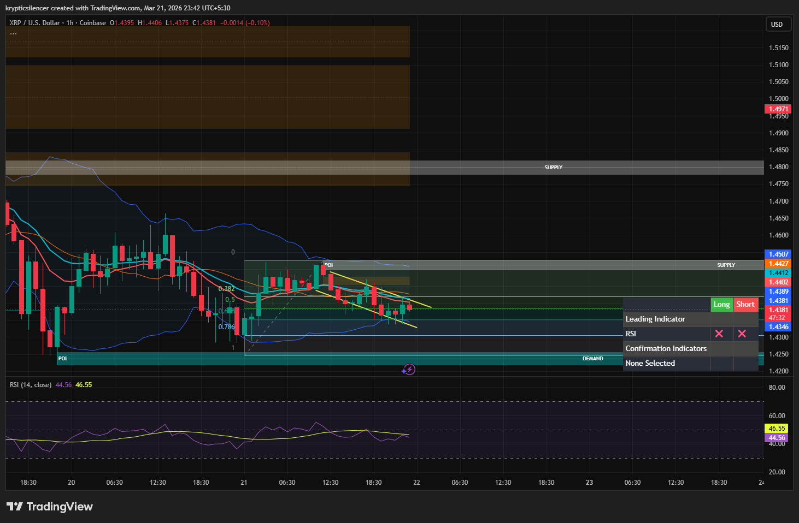

# XRP — 1H Breakout Structure & 0.5 Fibonacci Pivot

**Date:** 2026-03-21  
**Time:** ~23:42 IST  
**Instrument:** XRPUSD  
**Timeframe:** 1H  
**Venue:** Coinbase  
**Charting Platform:** TradingView  

---

## Context

XRP is currently trading inside a short-term descending structure after a prior move upward.  
Price is approaching a decision point within a compression pattern.

---

## Observation

### 1️⃣ Breakout Structure
- Price forming a descending wedge / compression pattern.
- Volatility decreasing, indicating a potential breakout soon.

### 2️⃣ Fibonacci Levels
- 0.5 Fibonacci level acting as a key pivot level.
- Price currently testing this region.

### 3️⃣ Supply Above
- Clear supply zone overhead.
- If breakout occurs, price may move toward supply.

### 4️⃣ RSI Behavior
- RSI around mid-range (~46), indicating neutral momentum.
- Enough room for a move in either direction.

---

## Hypothesis

### Scenario A — Bullish Breakout
If price breaks and holds above the 0.5 Fibonacci level, a bullish move toward the supply zone is likely.

### Scenario B — Rejection
If price fails to break above 0.5 Fib, price may continue downward within the structure toward demand.

---

## Invalidation / Confirmation

- Break and hold above 0.5 Fib → bullish continuation.
- Breakdown below structure → bearish continuation.

---

## Notes

This setup highlights a compression breakout scenario where the 0.5 Fibonacci level acts as the key decision point.

Text formatting and clarity were assisted by AI; the market analysis and structural interpretation are independently conducted by the author.  
This material is intended for educational and research documentation purposes only and does not constitute financial advice.
