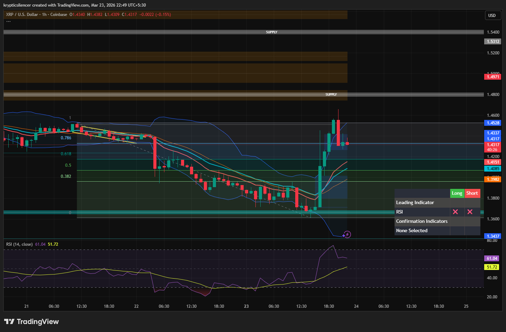

# XRP — 1H Upper Bollinger Band Rejection & Momentum Slowdown

**Date:** 2026-03-23  
**Time:** ~22:49 IST  
**Instrument:** XRPUSD  
**Timeframe:** 1H  
**Venue:** Coinbase  
**Charting Platform:** TradingView  

---

## Context

XRP recently experienced a strong bullish impulse from the demand zone, pushing price upward into a higher value area.

---

## Observation

### 1️⃣ Bollinger Band Interaction
- Price touched the upper Bollinger Band.
- This often signals short-term overextension.

### 2️⃣ RSI Momentum
- RSI moved above 60 during the impulse.
- Momentum now beginning to decline, indicating slowing bullish strength.

### 3️⃣ Resistance Area
- Price currently near a resistance / supply region.
- Rejection wicks visible near the top.

### 4️⃣ Current Structure
- After impulsive move, price is now consolidating.
- Possible transition from impulse to pullback phase.

---

## Hypothesis

### Scenario A — Short-Term Pullback
Price may retrace toward mid-range / EMA cluster before next move.

### Scenario B — Consolidation
Price may move sideways before deciding next direction.

---

## Invalidation / Confirmation

- Strong break above resistance → bullish continuation.
- Lower high formation → confirms pullback.

---

## Notes

This setup reflects a typical behavior where price touches the upper Bollinger Band and momentum begins to slow, often leading to a short-term pullback or consolidation.

Text formatting and clarity were assisted by AI; the market analysis and structural interpretation are independently conducted by the author.  
This material is intended for educational and research documentation purposes only and does not constitute financial advice.
