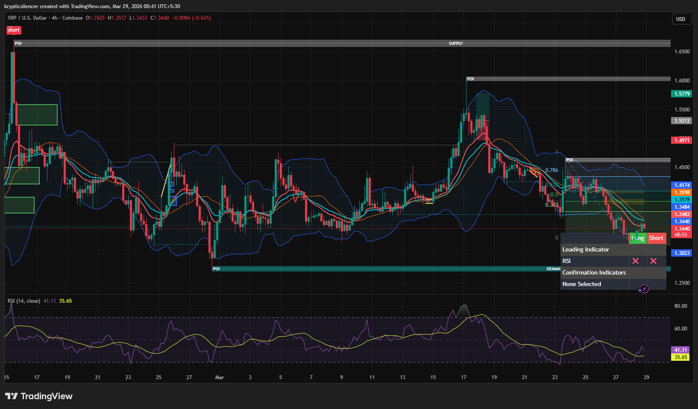

# XRP — Bearish Structure, Approaching Demand

**Date:** 2026-03-29  
**Timeframe:** 4H  
**Instrument:** XRPUSD  

---

## Context

XRP rejected from the supply zone and has been moving in a bearish structure since then, forming lower highs and lower lows. Price is now moving toward a key demand zone.

---

## Observation

### 1️⃣ Supply Rejection
- Clear rejection from the upper supply zone.
- This initiated the bearish structure.

### 2️⃣ Fibonacci Levels
- Price retraced into Fibonacci levels (0.5–0.786 zone) and continued downward.
- This area acted as a continuation zone for the bearish move.

### 3️⃣ Market Structure
- Lower highs and lower lows visible.
- Trend on this timeframe is bearish.

### 4️⃣ Demand Zone Below
- Price approaching a marked demand zone.
- This will likely act as a reaction area.

### 5️⃣ RSI
- RSI in lower range (~35–41), showing weak momentum.
- Not fully oversold yet, so continuation is possible before a strong reaction.

---

## Hypothesis

### Scenario A — Reaction From Demand
Price may bounce from demand and retrace toward Fibonacci levels or EMA zone.

### Scenario B — Bearish Continuation
If demand fails, price may continue further downward to the next demand zone.

---

## Invalidation / Confirmation

- Strong bullish reaction at demand → confirms bounce.
- Clean break below demand → confirms continuation.

---

## Notes

Market is currently in a bearish structure moving from supply toward demand.  
The reaction at demand will determine whether we get a retracement or continuation.

This material is for educational and research documentation purposes only and does not constitute financial advice.
