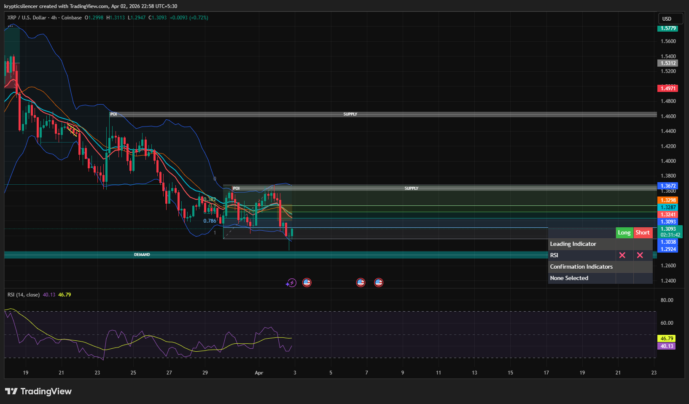

# XRP — Bullish Reaction From Demand + Fair Value Gap

**Date:** 2026-04-02  
**Timeframe:** 4H  
**Instrument:** XRPUSD  

---

## Context

XRP moved down into a key demand zone and formed a bullish reaction from that level. During the upward move, a Fair Value Gap (FVG) was created, indicating strong bullish momentum.

---

## Observation

### 1️⃣ Demand Reaction
- Price touched the demand zone and reacted upward.
- This indicates buyers stepping in at this level.

### 2️⃣ Fair Value Gap (FVG)
- A Fair Value Gap was created during the impulsive upward move.
- This suggests strong bullish momentum in the short term.

### 3️⃣ Fibonacci Levels
- Price is currently interacting with Fibonacci retracement levels.
- These levels may act as resistance during the move upward.

### 4️⃣ RSI
- RSI moving upward from lower levels (~40–46).
- Indicates increasing bullish momentum.

---

## Hypothesis

### Scenario A — Bullish Continuation
If price holds above the demand region and maintains structure, XRP may move toward the supply zone.

### Scenario B — FVG Refill
Price may retrace to fill the Fair Value Gap before continuing upward.

---

## Invalidation / Confirmation

- Hold above demand → bullish continuation.
- Break below demand → bullish setup invalidated.

---

## Notes

This setup shows a demand reaction followed by an impulsive move creating a Fair Value Gap, which often leads to either continuation or a retracement to refill the gap before continuation.

This material is for educational and research documentation purposes only and does not constitute financial advice.
