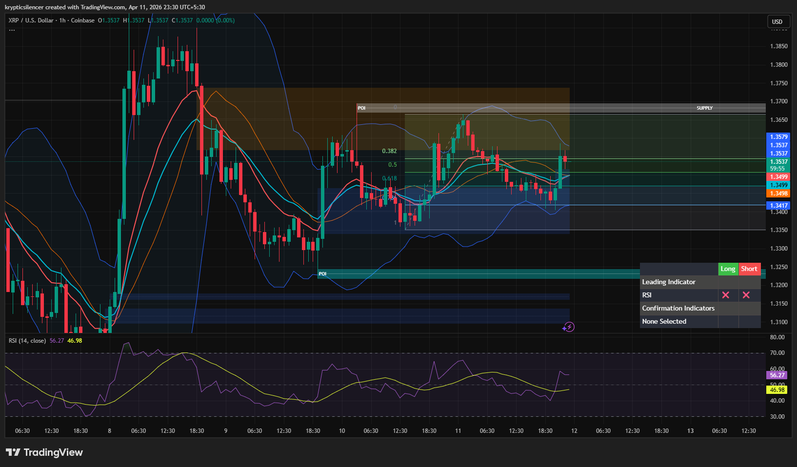

# XRP — 1H Range-Bound Rebalancing Between Demand and Supply

**Date:** 2026-04-11  
**Time:** ~23:30 IST  
**Instrument:** XRPUSD  
**Timeframe:** 1H  
**Venue:** Coinbase  
**Charting Platform:** TradingView  

---

## Context

XRP is currently trading within a range after a prior impulsive move. Price is oscillating between a defined demand zone and overhead supply, indicating a rebalancing phase rather than a clear trending environment.

---

## Observation

- **Market Structure:**  
  Structure is range-bound with no clear higher high or lower low continuation. Price is respecting both demand and supply boundaries.

- **Supply Zone:**  
  Multiple rejections from the upper supply region (~1.36–1.37) indicate strong selling pressure overhead.

- **Demand Zone:**  
  Price continues to find support in the lower demand region (~1.33–1.34), preventing further downside.

- **Fibonacci Behavior:**  
  Price is oscillating around the 0.382–0.618 retracement zone, reinforcing consolidation dynamics.

- **Momentum (RSI):**  
  RSI is hovering around midline, indicating neutral momentum with no strong directional bias.

---

## Hypothesis

The market is in a **range-bound rebalancing phase** between demand and supply.

Two conditional paths:

### Scenario 1 — Range Continuation
If price continues to respect both zones, consolidation is likely to persist with moves between demand and supply.

### Scenario 2 — Range Breakout
If price breaks and holds above supply, bullish continuation may occur.  
If price breaks below demand, bearish continuation becomes likely.

---

## Invalidation / Failure Mode

- Clear breakout and acceptance beyond range boundaries  
- Strong momentum shift (RSI trending strongly above or below midline)  
- Formation of sustained HH/HL or LH/LL structure  

---

## Notes

This analysis documents a **range-bound consolidation phase with rebalancing between key zones**, not a confirmed directional trend.

Text formatting and clarity were assisted by AI; the market analysis, chart interpretation, and structural assessment are independently conducted by the author.  
This material is intended for educational and research documentation purposes only and does not constitute financial advice.
