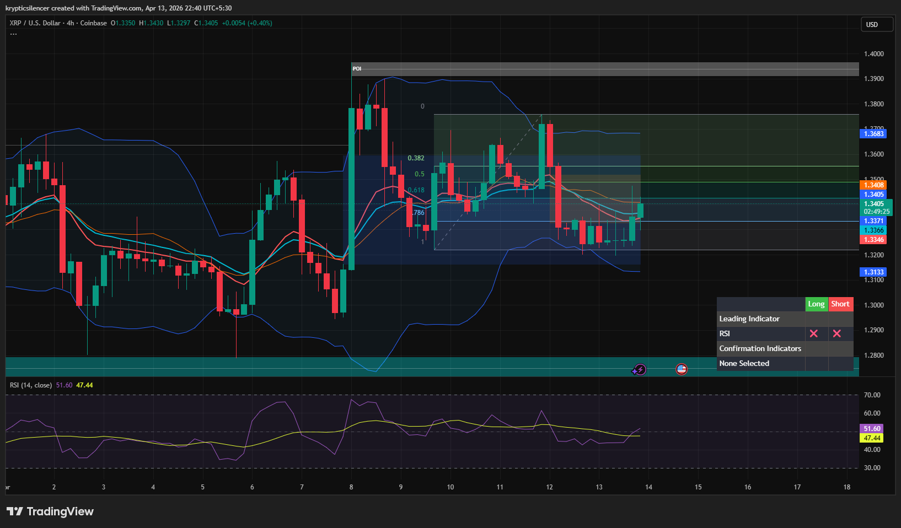

# XRP — 4H Continued Range Rebalancing With Weak Bounce

**Date:** 2026-04-13  
**Time:** ~22:40 IST  
**Instrument:** XRPUSD  
**Timeframe:** 4H  
**Venue:** Coinbase  
**Charting Platform:** TradingView  

---

## Context

XRP remains in a broader range-bound environment after prior impulsive movement. Price continues to oscillate between demand and supply, with no confirmed higher timeframe breakout. Recent price action shows a bounce from lower levels within the range.

---

## Observation

- **Market Structure:**  
  Structure remains non-directional on the higher timeframe, with price forming equal highs and lows within a defined range.

- **Recent Move:**  
  Price reacted from the lower portion of the range (~1.31–1.32) and is now attempting a short-term recovery.

- **Fibonacci Retracement:**  
  Price is moving back toward the 0.382–0.5 retracement region, indicating a typical rebalancing move within the range.

- **Supply Zone:**  
  Overhead resistance (~1.36–1.39) continues to cap upside, with prior rejections visible.

- **Momentum (RSI):**  
  RSI is around the midline, reflecting neutral momentum with slight recovery from lower levels.

---

## Hypothesis

The market remains in a **range-bound rebalancing phase** with a short-term bullish bounce.

Two conditional paths:

### Scenario 1 — Range Continuation
If price fails to break above the mid-range/supply region, continuation within the range is likely.

### Scenario 2 — Range Breakout Attempt
If price breaks and holds above the supply zone, a bullish expansion may follow.

---

## Invalidation / Failure Mode

- Breakdown below range lows (~1.31)  
- Strong rejection forming a lower high near mid-range  
- RSI losing midline and turning bearish  

---

## Notes

This analysis documents a **continued range-bound structure with short-term recovery**, not a confirmed directional breakout.

Text formatting and clarity were assisted by AI; the market analysis, chart interpretation, and structural assessment are independently conducted by the author.  
This material is intended for educational and research documentation purposes only and does not constitute financial advice.
