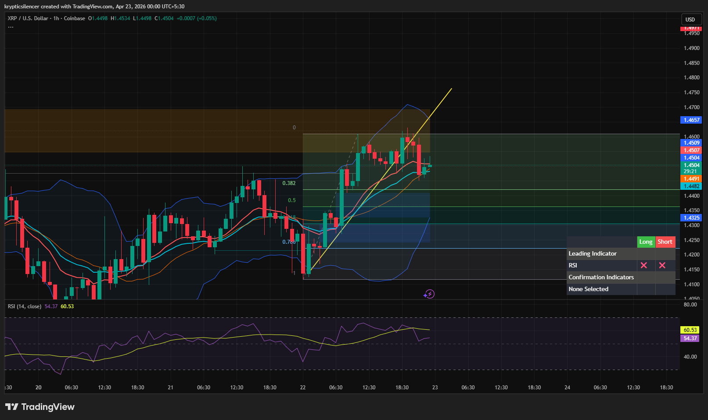

# XRP — 1H Bullish Structure With Pullback From Supply

**Date:** 2026-04-23  
**Time:** ~00:00 IST  
**Instrument:** XRPUSD  
**Timeframe:** 1H  
**Venue:** Coinbase  
**Charting Platform:** TradingView  

---

## Context

XRP showed a strong bullish move from a local low, forming an impulsive upward leg. After reaching a supply/POI region, price faced rejection and is now pulling back, indicating a transition from expansion to retracement.

---

## Observation

- **Market Structure:**  
  Short-term bullish structure with higher highs and higher lows, though currently experiencing a pullback.

- **Impulsive Move:**  
  Strong upward move from the recent low (~1.41 area), indicating aggressive buying.

- **Supply Zone:**  
  Price tapped a supply region (~1.46–1.47) and faced rejection.

- **Pullback Behavior:**  
  Price is retracing toward the 0.382–0.5 region, a typical retracement zone within a bullish trend.

- **Momentum (RSI):**  
  RSI remains above midline but has cooled slightly, indicating reduced momentum during the pullback.

- **Trendline Structure:**  
  Price was following a short-term ascending trendline, now testing it after rejection.

---

## Hypothesis

The market is in a **bullish structure with a corrective pullback**.

Two conditional paths:

### Scenario 1 — Continuation After Pullback
If price holds the retracement zone and forms a higher low, continuation toward supply is likely.

### Scenario 2 — Deeper Correction
If price loses support, a deeper retracement toward demand (~1.43–1.44) may occur.

---

## Invalidation / Failure Mode

- Breakdown below recent higher low  
- Loss of bullish structure  
- RSI dropping below midline with bearish continuation  

---

## Notes

This analysis documents a **bullish move followed by a corrective pullback**, not a confirmed reversal of trend.

Text formatting and clarity were assisted by AI; the market analysis, chart interpretation, and structural assessment are independently conducted by the author.  
This material is intended for educational and research documentation purposes only and does not constitute financial advice.
