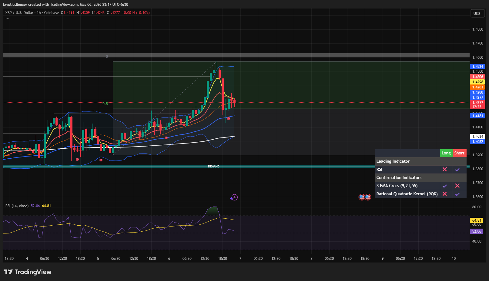

# XRP — 1H Cooling After Intraday Expansion

**Date:** 2026-05-06  
**Time:** 23:17 IST  
**Instrument:** XRPUSD  
**Timeframe:** 1H  
**Venue:** Coinbase  
**Charting Platform:** TradingView  

---

## Context

XRP pushed strongly into local highs during the session, reclaiming short-term bullish structure and expanding into the upper range. After the impulse, price is now showing signs of cooling as momentum fades near local resistance.

---

## Observation

- **Market Structure:**  
Short-term bullish structure remains intact, though price is slowing after the recent expansion.

- **Resistance Zone:**  
Price reacted near the upper range (~1.45), where local supply and upper Bollinger pressure triggered rejection.

- **Support Zone:**  
Mid-range support around the 0.5 region remains the key level for maintaining bullish continuation.

- **Momentum Condition:**  
RSI has cooled sharply from overbought, indicating short-term momentum exhaustion and likely consolidation.

- **Trend Condition:**  
Price remains above key short-term EMAs, keeping structure bullish unless support is lost.

---

## Hypothesis

XRP is likely entering a **short-term consolidation / pullback phase** after the recent intraday expansion.

Two conditional paths:

### Scenario 1 — Consolidation Then Continuation  
If XRP holds mid-range support and stabilizes, bullish continuation toward the upper range is likely after local cooldown.

### Scenario 2 — Deeper Pullback  
If support fails, price may rotate lower into the broader value area before attempting another bullish expansion.

---

## Invalidation / Failure Mode

- Breakdown below mid-range support with acceptance  
- Loss of short-term bullish EMA structure  
- RSI fading below neutral with weak reclaim  
- Failure to stabilize after pullback

---

## Notes

This looks like a standard cooldown after an impulsive bullish move. Current weakness appears corrective, not structural, unless XRP loses mid-range support decisively. The next directional move depends on whether buyers can defend the 0.5 region after this momentum reset.

This material is intended for educational and observational purposes only and does not constitute financial advice.
