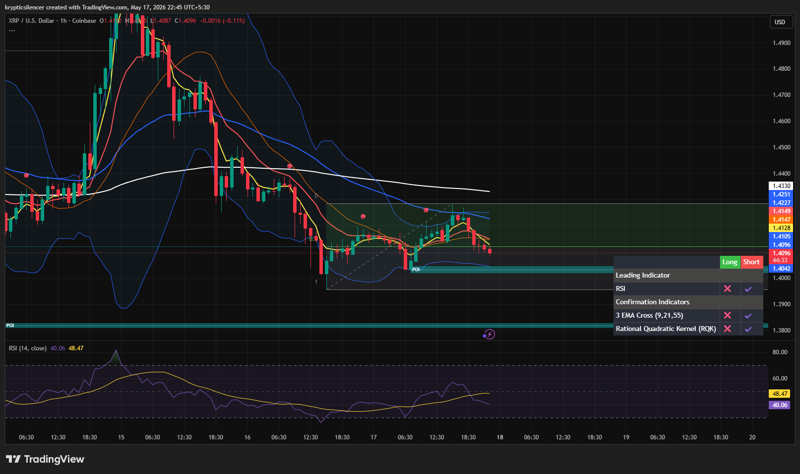

# XRP — 1H Rejection Below HTF Resistance

**Date:** 2026-05-17  
**Time:** 22:45 IST  
**Instrument:** XRPUSD  
**Timeframe:** 1H  
**Venue:** Coinbase  
**Charting Platform:** TradingView  

---

## Context

XRP remains under higher timeframe resistance after a failed recovery attempt. Price rejected near the upper local range and is now drifting back toward short-term support while momentum weakens.

---

## Observation

- **Market Structure:**  
Lower highs continue forming after the previous breakdown, keeping short-term structure bearish.

- **Resistance Zone:**  
Price failed to reclaim the 200 EMA and local resistance cluster around the 1.41–1.42 region.

- **Momentum:**  
RSI rolled over below midline levels, showing fading bullish momentum.

- **Moving Averages:**  
Short-term EMAs are compressing and turning downward, suggesting weakening trend continuation.

- **Support Region:**  
Local support near the POI zone is being tested again. Loss of this level may accelerate downside movement.

---

## Hypothesis

XRP is currently in a weak recovery phase beneath major resistance.

### Scenario 1 — Breakdown
If support near the current POI fails, price may revisit lower demand levels.

### Scenario 2 — Recovery
If buyers reclaim the EMA cluster and sustain above resistance, bullish continuation toward the upper range becomes possible.

---

## Invalidation / Failure Mode

- Strong reclaim above HTF resistance  
- RSI regaining bullish expansion above midline  
- Higher highs forming with volume confirmation  

---

## Notes

Current structure favors caution as XRP trades below key higher timeframe trend levels. Momentum remains indecisive with bearish pressure still active near resistance.

This analysis is for educational and observational purposes only and does not constitute financial advice.
