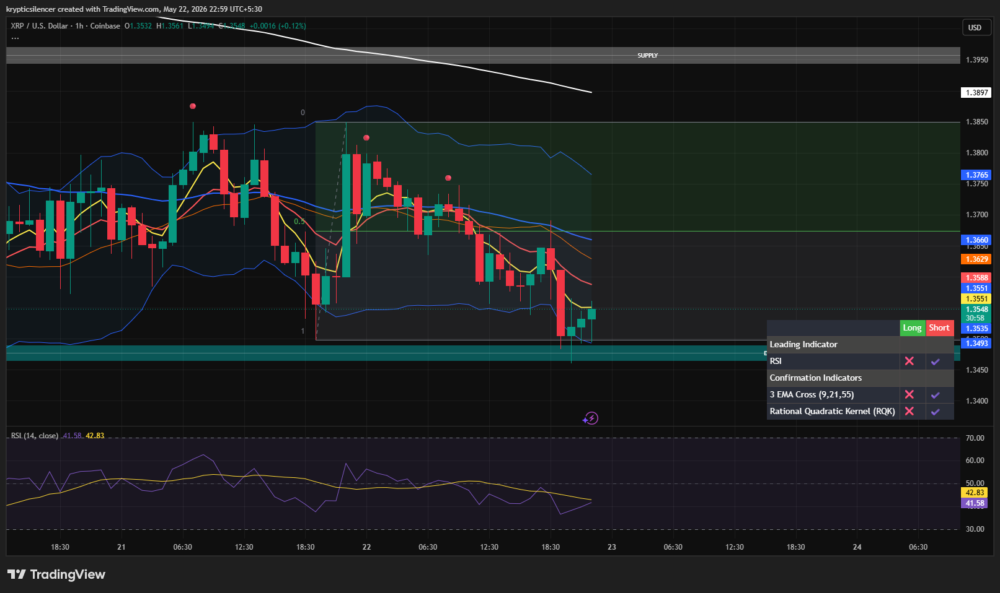

# XRP — 1H Weak Recovery From Demand

**Date:** 2026-05-22  
**Time:** 22:59 IST  
**Instrument:** XRPUSD  
**Timeframe:** 1H  
**Venue:** Coinbase  
**Charting Platform:** TradingView  

---

## Context

XRP is attempting a short-term recovery after reacting from local demand, though the broader structure remains weak beneath higher timeframe resistance.

---

## Observation

- **Market Structure:**  
Price continues forming lower highs despite the recent bounce from support.

- **Demand Zone:**  
Buyers defended the local demand region, triggering a temporary relief rally.

- **Momentum:**  
RSI is recovering slightly from oversold conditions but remains below strong bullish territory.

- **EMA Structure:**  
Price still trades below major EMA resistance clusters, keeping short-term bearish pressure active.

- **Volatility:**  
Recent candles show slowing downside momentum after aggressive selling pressure.

---

## Hypothesis

XRP is currently in a relief recovery phase inside a broader weak structure.

### Scenario 1 — Continuation Recovery
If buyers reclaim nearby EMA resistance, price may attempt a stronger move toward higher supply levels.

### Scenario 2 — Rejection
Failure to reclaim resistance may lead to another retest of the local demand zone.

---

## Invalidation / Failure Mode

- Breakdown below current demand support  
- RSI losing recovery momentum  
- Strong rejection from EMA resistance  

---

## Notes

Current recovery remains cautious while XRP trades beneath key trend resistance levels. Momentum has improved slightly, though structure still favors defensive trading conditions.

This analysis is for educational and observational purposes only and does not constitute financial advice.
