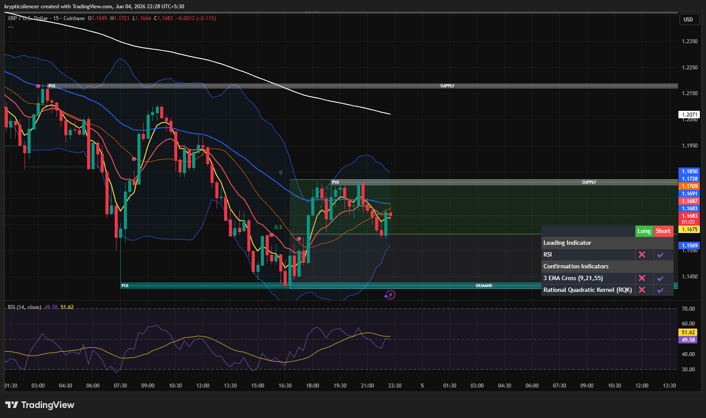

# XRP — 15M Recovery From Demand Into Supply Resistance

**Date:** 2026-06-04
**Time:** ~22:28 IST
**Instrument:** XRPUSD
**Timeframe:** 15M
**Venue:** Coinbase
**Charting Platform:** TradingView

---

## Context

XRP experienced a sharp decline into a well-defined demand zone before buyers stepped in aggressively, producing a strong intraday recovery.

The rebound successfully pushed price back toward the midpoint of the recent range, but XRP now faces a key supply region overhead that previously acted as resistance.

---

## Observation

### 1️⃣ Demand Zone Reaction

* Price formed a strong reaction from the marked demand zone.
* Multiple bullish candles emerged after liquidity was swept near local lows.
* Buyers successfully prevented further downside continuation.

The demand region remains respected by the market.

### 2️⃣ Recovery Toward Supply

* XRP rallied strongly from demand into the 1.17–1.18 resistance area.
* Price briefly tested supply before facing selling pressure.
* Several candles show hesitation beneath resistance.

This suggests active sellers remain positioned overhead.

### 3️⃣ EMA Structure

* Short-term EMAs have begun turning upward following the recovery.
* Price reclaimed the fast EMA cluster during the rally.
* However, the broader trend remains uncertain while below higher resistance.

Momentum has improved but structural confirmation is still pending.

### 4️⃣ RSI Conditions

* RSI recovered from lower levels and returned toward neutral territory.
* Momentum improved significantly during the bounce.
* Current readings indicate balanced conditions rather than overbought or oversold extremes.

This leaves room for expansion in either direction.

---

## Hypothesis

XRP is attempting to transition from a demand-driven rebound into a broader recovery phase.

Two conditional paths remain active:

### Scenario A — Bullish Continuation

A decisive break and acceptance above the 1.17–1.18 supply region would indicate buyer strength and open the door for continuation toward higher liquidity and resistance levels.

### Scenario B — Supply Rejection

Failure to reclaim supply could trigger another rotation lower toward the midpoint of the range and potentially back into demand support.

The current battle between demand-driven buyers and overhead supply remains unresolved.

---

## Invalidation / Confirmation

* Acceptance above supply resistance → bullish continuation confirmed.
* Rejection followed by loss of EMA support → recovery thesis weakens.
* Higher low formation above demand → bullish structure remains intact.

---

## Notes

This setup reflects a classic demand-to-supply rotation, where a strong reaction from support has carried price into a critical resistance zone. The next move will likely depend on whether buyers can convert the current supply area into support or if sellers regain control and force another range rotation.

Text formatting and clarity were assisted by AI; the market analysis and structural interpretation are independently conducted by the author.
This material is intended for educational and research documentation purposes only and does not constitute financial advice.
