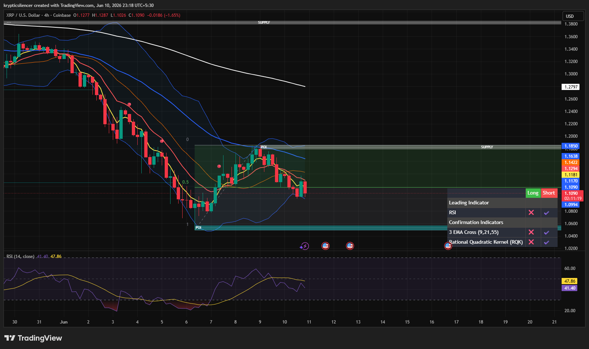

# XRP — 4H Rejection From Key Supply Zone

**Date:** 2026-06-10
**Time:** ~23:18 IST
**Instrument:** XRPUSD
**Timeframe:** 4H
**Venue:** Coinbase
**Charting Platform:** TradingView

---

## Context

XRP staged a strong recovery from the major demand zone established after the recent capitulation event. The rally successfully reclaimed short-term structure and carried price into a significant higher-timeframe supply region.

However, buyers were unable to achieve acceptance above resistance, resulting in a rejection from supply and a rotation back toward the middle of the recovery range.

---

## Observation

### 1️⃣ Supply Zone Rejection

* Price rallied directly into the marked supply region near recent swing highs.
* Multiple candles failed to establish acceptance above resistance.
* Selling pressure emerged immediately after the test.

This confirms that higher-timeframe sellers remain active within the supply zone.

### 2️⃣ Failed Breakout Attempt

* The recovery move reached the upper boundary of the range.
* Bulls were unable to generate continuation above resistance.
* Price has since rotated lower from the rejection area.

The move currently resembles a lower-high formation rather than a bullish breakout.

### 3️⃣ EMA Structure

* Short-term EMAs were reclaimed during the recovery phase.
* Recent weakness has pushed price back toward the EMA cluster.
* Fast moving averages are beginning to flatten.

Momentum is slowing after the initial recovery impulse.

### 4️⃣ RSI Momentum Shift

* RSI recovered strongly during the rally from demand.
* Recent readings have begun to decline from local highs.
* Momentum remains neutral but no longer favors aggressive upside continuation.

This suggests bullish momentum is fading beneath resistance.

### 5️⃣ Range Positioning

* XRP remains above the major demand zone despite the rejection.
* Current price sits near the midpoint of the active recovery range.
* Neither buyers nor sellers have fully regained control.

The market is transitioning into a decision phase following the supply rejection.

---

## Hypothesis

XRP is showing signs of weakness after failing to reclaim a key higher-timeframe supply region.

Two conditional paths remain active:

### Scenario A — Bearish Rotation

Continued rejection beneath supply could produce a lower high and drive price back toward demand support. Loss of local support would strengthen the bearish case.

### Scenario B — Recovery Resumption

If buyers reclaim momentum and break above supply, the rejection would be invalidated and XRP could continue expanding toward higher liquidity levels.

For now, the rejection from supply gives sellers a short-term advantage.

---

## Invalidation / Confirmation

* Acceptance above supply resistance → bearish thesis weakens.
* Lower high formation followed by loss of support → bearish rotation confirmed.
* Strong defense of demand and higher low formation → recovery structure remains valid.

---

## Notes

This setup highlights a classic recovery-into-supply reaction. While XRP successfully rebounded from demand, the inability to secure acceptance above higher-timeframe resistance has shifted momentum back toward neutrality and increases the probability of further consolidation or downside rotation.

Text formatting and clarity were assisted by AI; the market analysis and structural interpretation are independently conducted by the author.
This material is intended for educational and research documentation purposes only and does not constitute financial advice.
