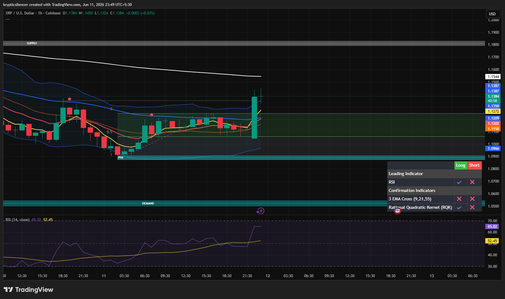

# XRP — 1H Breakout From Consolidation Range

**Date:** 2026-06-11
**Time:** ~23:49 IST
**Instrument:** XRPUSD
**Timeframe:** 1H
**Venue:** Coinbase
**Charting Platform:** TradingView

---

## Context

XRP spent several sessions consolidating above a major demand zone after recovering from recent lows. Price remained trapped within a tight range, repeatedly respecting support while struggling to generate meaningful upside momentum.

The latest candle has broken this equilibrium, producing a strong bullish expansion from consolidation and pushing XRP toward higher liquidity levels.

---

## Observation

### 1️⃣ Consolidation Breakout

* Price spent an extended period compressing within a narrow range.
* Multiple candles respected both local support and resistance boundaries.
* A strong bullish candle has now broken above the consolidation structure.

This suggests buyers have gained short-term control.

### 2️⃣ Demand Zone Respect

* The demand region beneath price remained untouched during consolidation.
* Higher lows continued to develop above support.
* Buyers consistently absorbed selling pressure.

The underlying recovery structure remains intact.

### 3️⃣ EMA Reclamation

* Price has reclaimed the entire short-term EMA cluster.
* Fast EMAs are beginning to turn upward.
* Dynamic resistance has transitioned back into support.

This is a constructive sign for short-term momentum.

### 4️⃣ Momentum Expansion

* RSI surged into the mid-60 region.
* Momentum accelerated alongside the breakout candle.
* No signs of bearish divergence are currently visible.

The breakout is supported by improving momentum conditions.

### 5️⃣ Resistance Ahead

* Price is approaching the upper boundary of the broader recovery range.
* Nearby liquidity and resistance remain overhead.
* The next reaction near local highs will determine whether expansion continues.

The breakout has improved structure, but follow-through remains important.

---

## Hypothesis

XRP is attempting to transition from consolidation into a continuation phase of the recovery trend.

Two conditional paths remain active:

### Scenario A — Bullish Continuation

Sustained acceptance above the breakout level could trigger expansion toward higher liquidity zones and the next resistance region overhead.

### Scenario B — Breakout Failure

Failure to maintain the breakout and a move back inside the previous range would suggest a liquidity sweep and could lead to renewed consolidation.

For now, buyers hold the advantage while price remains above the breakout zone.

---

## Invalidation / Confirmation

* Acceptance above recent highs → bullish continuation confirmed.
* Retest and defense of breakout support → recovery structure strengthens.
* Return below the consolidation range → bullish thesis weakens.

---

## Notes

This setup reflects a classic consolidation-to-expansion transition. XRP spent considerable time building a base above demand before producing a strong bullish breakout supported by improving RSI and reclaimed EMA structure. The next key test will be whether buyers can sustain momentum as price approaches higher resistance.

Text formatting and clarity were assisted by AI; the market analysis and structural interpretation are independently conducted by the author.
This material is intended for educational and research documentation purposes only and does not constitute financial advice.
