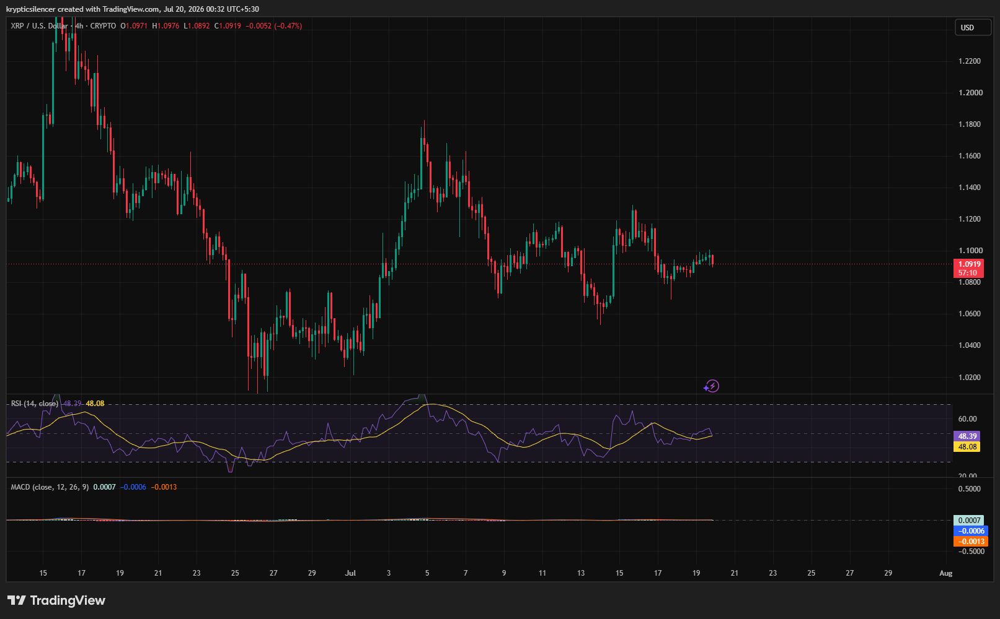

# XRP — 4H Range-Bound Consolidation Signals Market Indecision

**Date:** 2026-07-20  
**Time:** ~00:32 IST  
**Instrument:** XRPUSD  
**Timeframe:** 4H  
**Venue:** CRYPTO  
**Charting Platform:** TradingView  

---

## Context

Following a sharp decline from the mid-June highs, XRP has transitioned into a broad consolidation phase. Rather than establishing a clear trend, price has spent recent sessions oscillating within a relatively narrow range around the 1.09 region.

Momentum has faded considerably as buyers and sellers remain evenly matched.

---

## Observation

### 1️⃣ Sideways Market Structure

* Price continues to rotate within a horizontal trading range.
* Neither buyers nor sellers have established sustained control.
* Recent swings remain contained inside previous highs and lows.

The market currently lacks directional conviction.

### 2️⃣ Resistance Continues to Cap Rallies

* Multiple recovery attempts have stalled near recent swing highs.
* Buyers have struggled to build follow-through momentum.
* Price repeatedly returns toward the middle of the range.

Overhead resistance remains firmly intact.

### 3️⃣ RSI Holds Near Neutral

* RSI is fluctuating around the 50 level.
* Momentum neither favors bulls nor bears.
* The indicator reflects a balanced market environment.

Neutral RSI supports the ongoing consolidation.

### 4️⃣ MACD Flattens Near Zero

* MACD lines are tightly compressed.
* Histogram remains close to the zero line.
* Momentum has largely disappeared after recent volatility.

Indicators suggest a lack of strong directional pressure.

### 5️⃣ Breakout Still Awaited

* XRP continues trading inside its established range.
* Neither support nor resistance has been decisively broken.
* A breakout will likely determine the next sustained move.

Current price action favors patience until confirmation appears.

---

## Hypothesis

XRP remains in a consolidation phase following its earlier correction, with momentum indicators reflecting market indecision.

Two conditional paths remain active:

### Scenario A — Bullish Breakout

A decisive move above range resistance accompanied by strengthening momentum could initiate a fresh recovery phase.

### Scenario B — Bearish Breakdown

Failure to defend range support would increase the probability of renewed downside and continuation of the broader corrective trend.

Until a breakout occurs, consolidation remains the dominant expectation.

---

## Invalidation / Confirmation

* Break above recent range highs → bullish continuation gains credibility.
* RSI holding above 50 with expanding MACD momentum → buyers regain control.
* Breakdown below established range support → bearish continuation confirmed.

---

## Notes

XRP is currently trading inside a well-defined consolidation range after a prolonged correction. With RSI near neutral and MACD flattening around the zero line, momentum remains balanced. The eventual breakout from this range is likely to determine the next meaningful trend.

Text formatting and clarity were assisted by AI; the market analysis and structural interpretation are independently conducted by the author. This material is intended for educational and research documentation purposes only and does not constitute financial advice.
