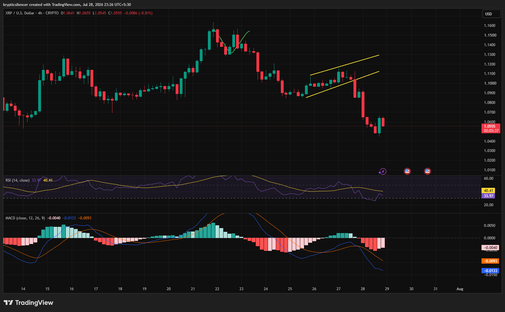

# XRP — 4H Rising Channel Breakdown Signals Shift Toward Bearish Momentum

**Date:** 2026-07-28  
**Time:** ~23:26 IST  
**Instrument:** XRPUSD  
**Timeframe:** 4H  
**Venue:** CRYPTO  
**Charting Platform:** TradingView  

---

## Context

XRP spent several sessions recovering inside a well-defined ascending channel after an earlier decline. The gradual recovery suggested improving sentiment, but buyers failed to sustain the structure. Price has now broken decisively below channel support, signaling a shift back toward bearish momentum.

The market is attempting to stabilize after the breakdown.

---

## Observation

### 1️⃣ Ascending Channel Breakdown

* XRP respected a rising channel during its recovery phase.
* Price broke below the lower trendline with strong bearish candles.
* The breakdown invalidated the short-term bullish structure.

Sellers have regained control of the market.

### 2️⃣ Sharp Momentum Shift

* Selling pressure accelerated immediately after the channel failed.
* Price quickly moved toward the 1.05 region.
* The decline erased much of the previous recovery.

The breakdown was accompanied by strong downside conviction.

### 3️⃣ RSI Near Oversold Territory

* RSI has fallen into the low-30 region.
* Momentum remains weak despite a small rebound.
* Buyers have yet to produce a meaningful recovery.

RSI reflects persistent bearish pressure.

### 4️⃣ MACD Turns Increasingly Bearish

* MACD remains below the signal line.
* Histogram continues printing negative values.
* Bearish momentum is still expanding.

Momentum indicators continue to favor sellers.

### 5️⃣ Support Becomes Critical

* Price is attempting to stabilize after the sharp decline.
* Current support is the first area where buyers may respond.
* Failure to hold this region could trigger another wave lower.

The reaction around support will likely determine the next move.

---

## Hypothesis

XRP has shifted back into a bearish structure following the breakdown of its ascending channel.

Two conditional paths remain active:

### Scenario A — Relief Bounce

If current support holds and momentum begins improving, XRP could stage a short-term recovery toward the broken channel.

### Scenario B — Bearish Continuation

Failure to defend support would reinforce the bearish trend and increase the probability of further downside.

The technical structure currently favors sellers until buyers reclaim key resistance.

---

## Invalidation / Confirmation

* Reclaim the broken channel and recent swing highs → bearish outlook weakens.
* RSI recovering above 50 with a bullish MACD crossover → recovery gains credibility.
* Breakdown below current support → bearish continuation confirmed.

---

## Notes

XRP's breakdown from its ascending channel marks a notable shift in market structure. With RSI approaching oversold territory and MACD remaining firmly bearish, momentum currently favors sellers. The nearby support zone is now the key level to monitor for either stabilization or continued downside.

Text formatting and clarity were assisted by AI; the market analysis and structural interpretation are independently conducted by the author. This material is intended for educational and research documentation purposes only and does not constitute financial advice.
