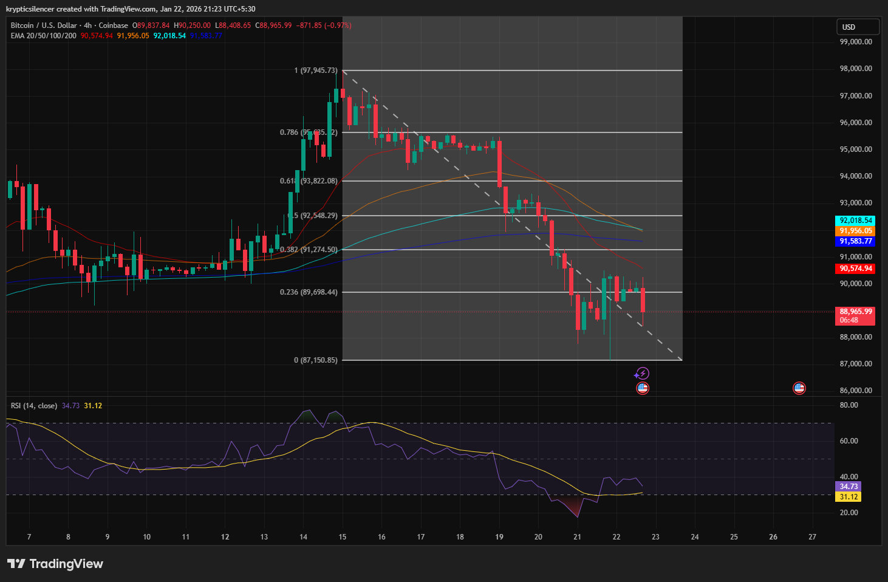

# Bitcoin 4-Hour Downtrend Structure Ahead of FOMC Meeting

**Date:** 2026-01-22  
**Time:** 21:23 IST  
**Instrument:** BTC / USD  
**Timeframe:** 4-hour  
**Venue:** Coinbase  
**Charting Platform:** TradingView  

---

## Context
Bitcoin is currently trading within a short-term downtrend on the 4-hour
timeframe, following a breakdown from a prior consolidation range.

This move is occurring in the lead-up to the upcoming FOMC meeting,
a macro event that often coincides with reduced liquidity and cautious
positioning across risk assets.

## Observation
Price has formed an descending structure with a series of lower highs and lower lows, with constant rejection at a downward-sloping trendline.

The fall has progressed through several Fibonacci retracement levels and is also below key medium-term moving averages.

The Relative Strength Index (RSI) is currently ranging in the low 30s, which is a sign of weak momentum but not oversold.

## Hypothesis
If the bearish momentum continues and the price is unable to find acceptance above the falling structure, then the path towards the lower support levels may continue to be the most likely outcome.

On the other hand, due to the proximity of the FOMC meeting, it is not possible to rule out the possibility of mean reversion or short-term basing due to this hypothesis 
is subject to the acceptance of post-event prices and the resolution of the current structural weakness.
This entry documents a short-term bearish structural regime observed on
the 4-hour timeframe in the presence of elevated macro event risk.

It is recorded solely for research and regime-classification purposes.
No trade recommendation, prediction, or financial advice is expressed.
