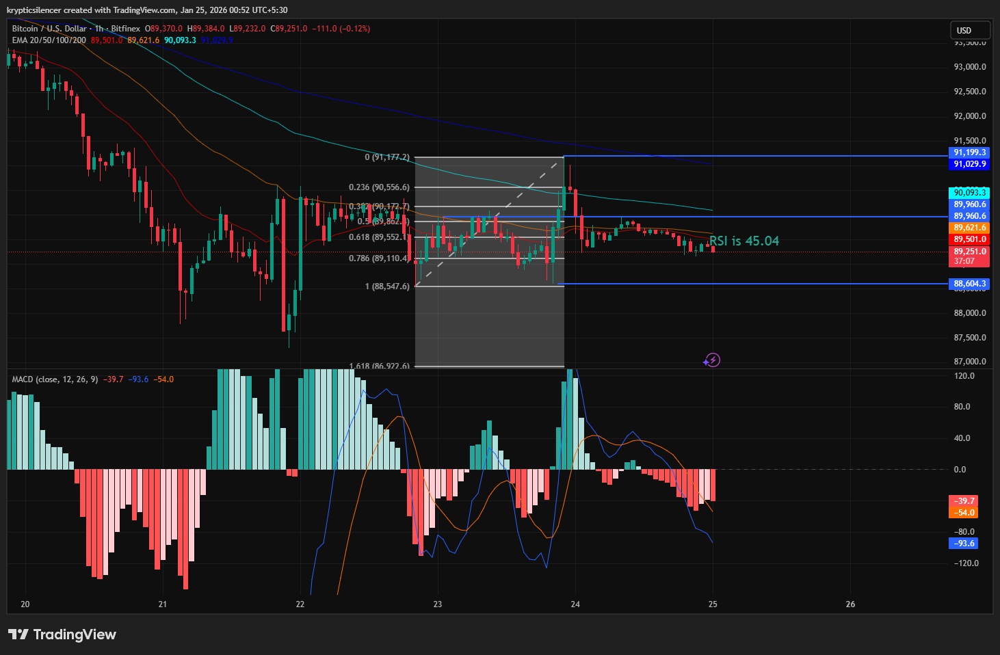

# Bitcoin 1-Hour Suppressed Regime Ahead of FOMC Meeting

**Date:** 2026-01-25  
**Time:** 00:52 IST  
**Instrument:** BTC / USD  
**Timeframe:** 1-hour  
**Venue:** Bitfinex  
**Charting Platform:** TradingView  

---

## Context
Bitcoin is currently trading in a short-term range on the 1-hour chart
after a prior impulsive drop. Following the sell-off, price tried
a rebound but was unable to gain broad acceptance above nearby
resistance and descending moving averages.

This is happening in the run-up to the forthcoming FOMC meeting,
a macro event that frequently occurs in conjunction with a decrease in liquidity and a 
suppression of trend development, and high event risk.

## Observation
A bullish engulfing pattern formed within the range but failed to achieve
follow-through, indicating weak initiative buying and rapid absorption
near resistance.

It is true because the RSI is currently near the mid-40s region.
consistent with a neutral-to-weak momentum regime.

MACD stays below the zero line, with frequent crossovers and fallacy.
Amplitude reflects a choppy, non-trending environment with poor

Directional signal quality.
Price continues to respect the descending structure and horizontal boundaries of the range, 
suggesting a continued range control rather than trend Initiation.

## Hypothesis
Prior to the FOMC meeting, prices could remain in a suppressed, range-bound environment with limited expansion
as market participants reduce directional risk in anticipation of the macroeconomic catalyst.

After the event, there is expected to be expansion, but the direction of the bias is still in 
question and will depend on price acceptance above the current range.

## Notes
This entry documents a short-term suppressed and pre-event regime observed
on the 1-hour timeframe.

It is recorded solely for research and regime-classification purposes.
No trade recommendation, prediction, or financial advice is expressed.
