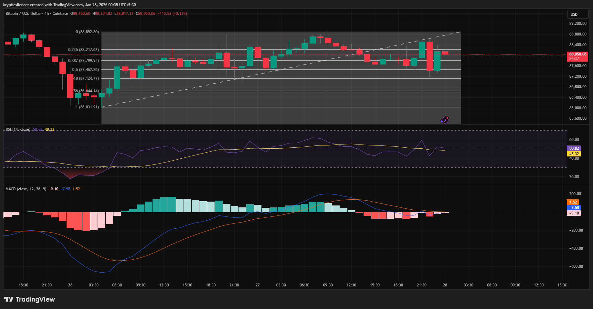

# Bitcoin 1-Hour Neutral Balance Regime

**Date:** 2026-01-28  
**Time:** 00:35 IST  
**Instrument:** BTC / USD  
**Timeframe:** 1-hour  
**Venue:** Coinbase  
**Charting Platform:** TradingView  

 
---

## Context
Bitcoin is trading within a well-defined horizontal range on the 1-hour
timeframe following a prior impulsive decline and subsequent recovery.

Price is currently oscillating within the middle of the range rather than
testing extreme support or resistance.

## Observation
Relative Strength Index (RSI) is stabilizing near the neutral 50 level,
indicating the absence of a dominant momentum regime.

MACD is hovering near the zero line with low-amplitude oscillations,
reflecting weak trend strength and a balanced flow environment.

Price remains contained within the range and near the mid-level of the
recent Fibonacci retracement structure.

## Hypothesis
In the absence of renewed momentum, price may continue to rotate within
the current range rather than develop a sustained directional trend.

Directional bias remains unresolved and is contingent on acceptance
outside the established range.

## Notes
This entry documents a short-term neutral and balance regime observed on
the 1-hour timeframe.

It is recorded solely for research and regime-classification purposes.
No trade recommendation, prediction, or financial advice is expressed.
