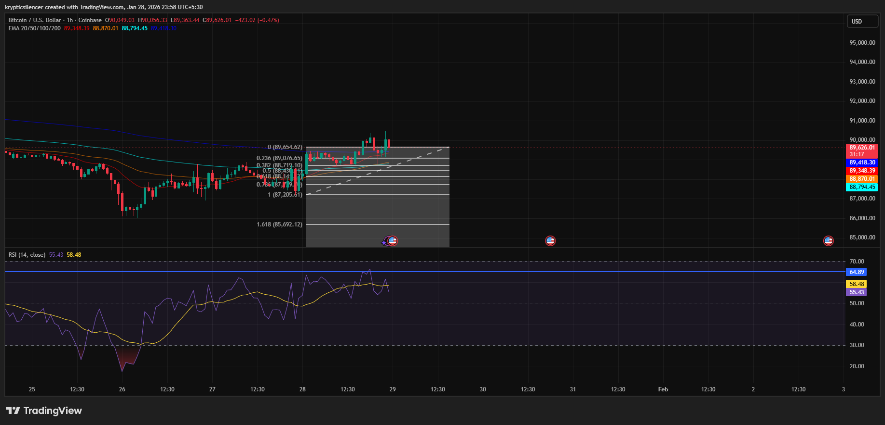

# Bitcoin 1-Hour RSI Expansion and Subsequent Pullback

**Date:** 2026-01-28  
**Time:** 23:58 IST  
**Instrument:** BTC / USD  
**Timeframe:** 1-hour  
**Venue:** Coinbase  
**Charting Platform:** TradingView  

---

## Context
Bitcoin moved from a short-term consolidation range base to a higher range on the 1-hourly chart, 
after a recovery from the recent lows.

## Observation
 During the upside movement, the Relative Strength Index (RSI) made an attempt to reach the mid-60s, showing strong bullish momentum. Later, the RSI failed to
 maintain thestrong levels and turned downwards, as the price made a retreat from the top of the recent range.

The price is still above the major short-term support levels, showing that there is a pause in the trend rather than a reversal.

## Hypothesis
If RSI stabilizes above the neutral zone and price holds within the
upper portion of the range, continuation may remain possible.
Failure to maintain support would favor further rotation within the
broader range.

## Notes
This entry documents a momentum expansion followed by short-term
mean reversion on the 1-hour timeframe.

No trade recommendation or financial advice is expressed.
