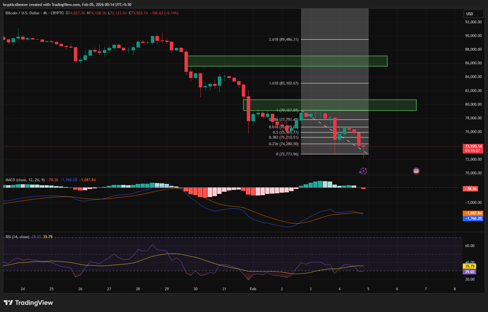

# Bitcoin — 4H Bearish Continuation vs Corrective Expansion

**Date:** 2026-02-05  
**Time:** ~00:15 IST  
**Instrument:** BTCUSD  
**Timeframe:** 4H  
**Venue:** Crypto / USD  
**Charting Platform:** TradingView  

---

## Context

Bitcoin remains within a clear bearish structure on the 4-hour timeframe following multiple impulsive sell-offs.  
Price continues to respect lower highs and lower lows, with prior demand zones failing to produce sustained reversals.

Current price action is unfolding beneath multiple **unfilled Fair Value Gaps (FVGs)**, indicating inefficiency left by aggressive selling.

---

## Observation

- **Fair Value Gaps:**  
  Multiple bearish FVGs (highlighted in green) remain unmitigated above price, particularly in the **77k–80k** and **83k** regions. These zones act as overhead supply unless reclaimed with acceptance.

- **Momentum (MACD):**  
  MACD remains below the zero line, with momentum still favoring the downside. Recent histogram contraction reflects short-term slowing, not a confirmed reversal.

- **RSI:**  
  RSI is currently near **28**, indicating oversold conditions. This supports the possibility of a corrective bounce but does not invalidate the broader bearish regime.

- **Price Behavior:**  
  Recent price action shows repeated relief rallies (72 → 76 → 72), suggesting liquidity-driven reactions rather than structural trend change.

---

## Hypothesis

The market is currently at a **decision point** between continuation and correction.

### Scenario 1 — Corrective Expansion (Conditional)
If price stabilizes and reclaims lower FVG levels, a corrective rotation toward:
- **~77k–78k**, and potentially  
- **~83k** (higher timeframe FVG / prior supply)

is possible. Such a move would be classified as a **bear market rally**, not a trend reversal, unless acceptance occurs above these zones.

### Scenario 2 — Bearish Continuation
Failure to reclaim lower FVGs, followed by renewed momentum expansion, increases the probability of continuation toward:
- **~73k**, and potentially  
- **~63k**, aligned with prior liquidity pools and structural extension targets.

---

## Notes on Candlestick Signals

Bullish engulfing candles observed at prior lows (93k, 83k, 73k) have historically resulted in **short-term relief moves**, not sustained reversals.  
In the current structure, similar signals are treated as **reactive responses** unless confirmed by higher-timeframe structure shift.

---

## Invalidation / Failure Mode

- Acceptance above 83k with structural shift on 4H  
- Sustained momentum expansion into higher FVGs  
- RSI reclaiming and holding above mid-range with price acceptance  

---

## Notes

This analysis documents **conditional scenarios within a dominant bearish structure**.  
Directional bias remains to the downside unless invalidated by acceptance above key inefficiency zones.
## Notes

This document was generated with the assistance of AI for formatting and clarity.  
The underlying market analysis, chart interpretation, and scenario construction are independently conducted by the author.

This analysis is intended for educational and research documentation purposes and does not constitute financial advice.
