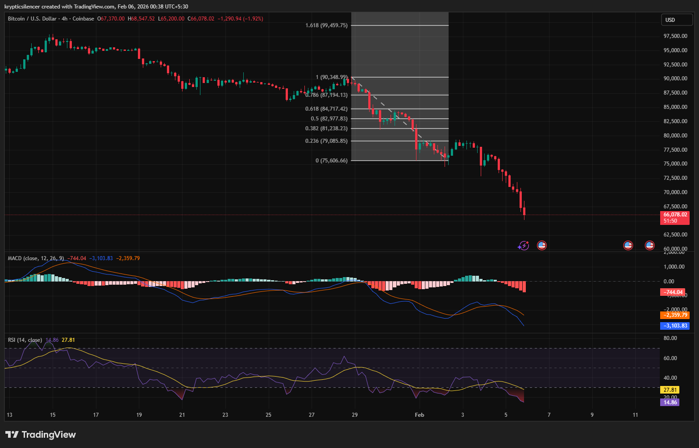

# Bitcoin — 4H Bearish Continuation & Momentum Exhaustion Watch

**Date:** 2026-02-06  
**Time:** ~00:40 IST  
**Instrument:** BTCUSD  
**Timeframe:** 4H  
**Venue:** Coinbase  
**Charting Platform:** TradingView  

---

## Context

Following the prior analysis, Bitcoin has continued to trade lower within a well-defined bearish structure.  
Price failed to reclaim overhead inefficiencies and has extended the move to fresh local lows, confirming downside continuation rather than corrective expansion.

The market is now approaching levels where **momentum exhaustion** becomes a relevant consideration.

---

## Observation

- **Structure:**  
  The sequence of lower highs and lower lows remains intact. Prior relief rallies failed to gain acceptance, reinforcing bearish control.

- **RSI:**  
  RSI is now deeply oversold, printing near **14**, a level historically associated with momentum exhaustion rather than immediate continuation. This does not imply reversal, but signals elevated probability of short-term stabilization or reactive bounce.

- **MACD:**  
  MACD remains firmly below the zero line, confirming bearish momentum. However, extended histogram expansion suggests the move may be approaching late-stage acceleration.

- **Price Behavior:**  
  The current decline aligns with previously identified downside continuation risk, with price accelerating rather than basing.

---

## Hypothesis

The broader bearish structure remains **valid and in control**.

However, given:
- Extreme RSI readings,
- Extended downside momentum,
- Distance traveled without meaningful consolidation,

the market is approaching a zone where **short-term reaction or consolidation** becomes increasingly likely.

Any upside response from here would be treated as **reactive or corrective**, unless followed by structural acceptance and momentum shift on the 4H timeframe.

---

## Invalidation / Failure Mode

- Sustained acceptance above prior lower-high resistance  
- Momentum shift with RSI reclaiming and holding mid-range  
- MACD crossing with expansion above the zero line  

---

## Notes

This document records a **continuation phase within a dominant bearish regime**, with attention shifting toward potential momentum exhaustion rather than directional bias change.

Text formatting and clarity were assisted by AI; the market analysis, chart interpretation, and scenario assessment are independently conducted by the author.  
This material is intended for educational and research documentation purposes only and does not constitute financial advice.
