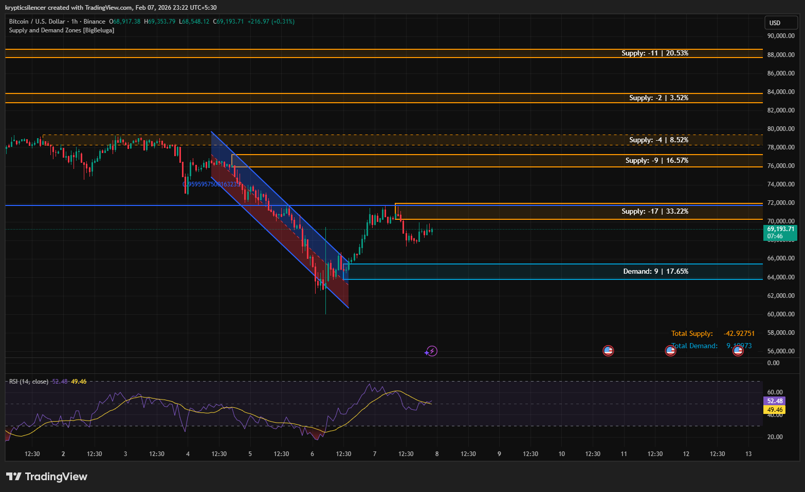

# Bitcoin — 1H Supply–Demand Rebalance After Impulsive Decline

**Date:** 2026-02-07  
**Time:** ~23:22 IST  
**Instrument:** BTCUSD  
**Timeframe:** 1H  
**Venue:** Binance  
**Charting Platform:** TradingView  

---

## Context

Bitcoin experienced a sharp impulsive decline, forming a well-defined descending channel before reacting strongly from a lower demand zone.  
The bounce that followed represents a relief move within a broader corrective environment rather than a confirmed trend reversal.

Price is currently trading between clearly defined **demand below** and multiple **overhead supply zones**, placing the market in a short-term balance phase.

---

## Observation

- **Demand Zone Reaction:**  
  Price reacted decisively from a key demand region around the mid-60k area, suggesting short-term absorption of sell-side liquidity and exhaustion of immediate downside pressure.

- **Impulsive Recovery:**  
  The rebound out of demand was sharp and directional, breaking the descending channel structure and indicating a shift from expansion to consolidation.

- **Supply Overhead:**  
  Multiple supply zones remain stacked above current price (notably around ~72k, ~76k, and higher), acting as potential resistance and areas where selling pressure may re-enter.

- **RSI:**  
  RSI has recovered from oversold levels and is now hovering near the mid-range, consistent with a neutral-to-corrective regime rather than strong trend continuation.

---

## Hypothesis

The market is transitioning from **impulse to range**.

As long as price remains above the defended demand zone, short-term consolidation or corrective upside rotations are possible.  
However, sustained bullish continuation would require acceptance above nearby supply zones; otherwise, price may continue to rotate between demand and supply without establishing a directional trend.

---

## Invalidation / Failure Mode

- Loss of the defended demand zone  
- Rejection and expansion from overhead supply with increasing downside momentum  
- RSI rolling over and failing to hold the mid-range  

---

## Notes

This analysis documents a **post-impulse rebalancing phase** defined by supply–demand interaction rather than directional conviction.

Text formatting and clarity were assisted by AI; the market analysis, chart interpretation, and scenario assessment are independently conducted by the author.  
This material is intended for educational and research documentation purposes only and does not constitute financial advice.
