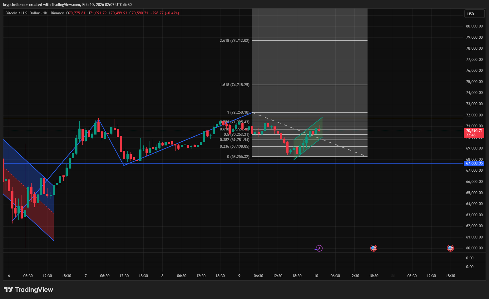

# Bitcoin — 1H Range Rotation & Corrective Channel

**Date:** 2026-02-10  
**Time:** ~02:05 IST  
**Instrument:** BTCUSD  
**Timeframe:** 1H  
**Venue:** Binance  
**Charting Platform:** TradingView  

---

## Context

Bitcoin is trading within a broader consolidation range after a prior impulsive move.  
Recent price action shows a corrective advance unfolding inside a rising channel, while the higher-timeframe range boundaries remain intact.

Price is currently positioned below the upper range resistance and above the lower range support, placing the market in a rotational regime rather than trend expansion.

---

## Observation

- **Range Structure:**  
  The market continues to respect a well-defined horizontal range, with repeated reactions at both upper and lower boundaries.

- **Corrective Channel:**  
  The current advance is occurring within a narrow rising channel, suggesting corrective behavior rather than impulsive upside expansion.

- **Fibonacci Interaction:**  
  Price is interacting with key Fibonacci retracement levels from the prior downswing, with reactions occurring near mid-range levels rather than full retracement.

- **Price Behavior:**  
  Momentum within the channel appears controlled, with overlapping candles and reduced range, consistent with consolidation rather than breakout conditions.

---

## Hypothesis

The market is in a **range rotation phase**.

As long as price remains inside the rising channel and below upper range resistance, upside moves are treated as corrective.  
A sustained breakout would require acceptance above the range high; failure to hold the channel increases the likelihood of rotation back toward the lower range support.

---

## Invalidation / Failure Mode

- Acceptance above the upper range boundary with expanding momentum  
- Breakdown of the rising channel with downside acceleration  
- Loss of lower range support  

---

## Notes

This analysis documents **short-term corrective structure within a broader consolidation environment**.

Text formatting and clarity were assisted by AI; the market analysis, chart interpretation, and scenario assessment are independently conducted by the author.  
This material is intended for educational and research documentation purposes only and does not constitute financial advice.
