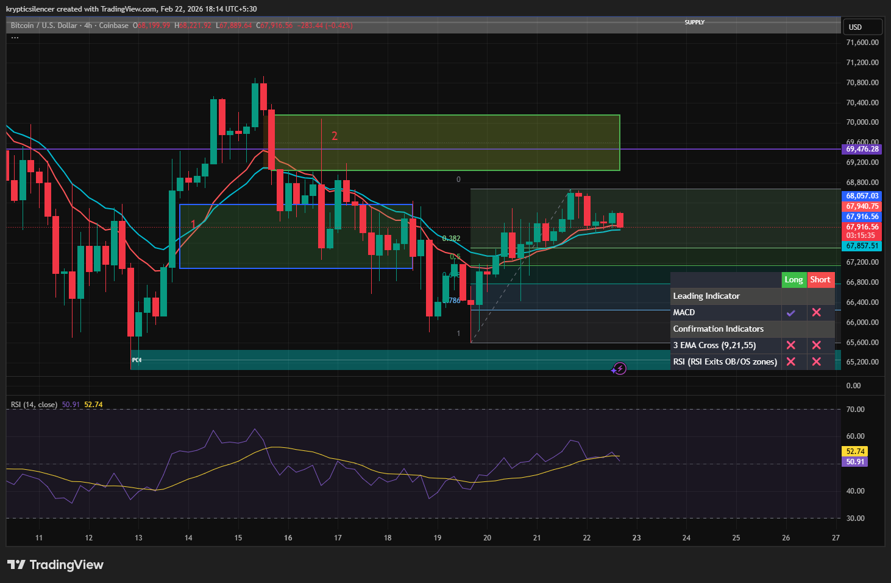

# Bitcoin — 4H Hammer Reversal at Discount

**Date:** 2026-02-22  
**Time:** ~18:15 IST  
**Instrument:** BTCUSD  
**Timeframe:** 4H  
**Venue:** Coinbase  
**Charting Platform:** TradingView  

---

## Context

After a corrective leg within a broader intraday range, Bitcoin rotated into a deeper retracement zone.  
Price approached prior discount levels and reacted from a key support region within the range structure.

Higher timeframe supply remains overhead, but short-term price action showed signs of demand absorption.

---

## Observation

### 1️⃣ Hammer Formation
- A clear 4H hammer printed at local lows.
- Long lower wick indicates aggressive downside rejection.
- Body closed near the upper portion of the candle, signaling demand response.

This suggests seller exhaustion at the tested level.

### 2️⃣ Fibonacci Reaction
- Reaction occurred near deeper retracement (0.618–0.786 region).
- Confluence with prior structure support strengthens the level.

### 3️⃣ Momentum Shift
- RSI stabilized and began curling upward from mid-range.
- Short-term EMAs began compressing, indicating potential shift from expansion to accumulation.

### 4️⃣ Structural Positioning
- Hammer formed after a lower low attempt.
- Follow-through candles began reclaiming intraday imbalance.

---

## Hypothesis

The hammer suggests potential short-term bullish rotation while its low remains protected.

Two conditional paths:

### Scenario A — Bullish Continuation
Acceptance above the hammer high opens room for continuation toward mid-range and possibly range highs.

### Scenario B — Failure & Breakdown
Loss of the hammer low invalidates the reversal signal and reopens downside expansion toward deeper liquidity.

Until the low is violated, short-term bias shifts cautiously bullish.

---

## Invalidation / Confirmation

- Break below hammer low → reversal failure.
- Acceptance above hammer high → confirmation of continuation.

---

## Notes

This setup documents a higher timeframe hammer forming at discount within a broader range context.

Text formatting and clarity were assisted by AI; the market analysis and structural interpretation are independently conducted by the author.  
This material is intended for educational and research documentation purposes only and does not constitute financial advice.
