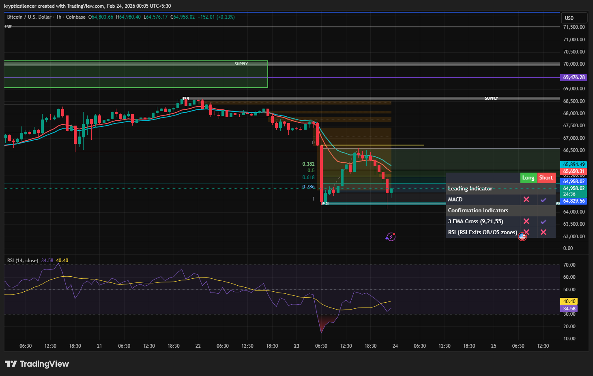

# Bitcoin — 1H Impulse Breakdown & Retracement Rejection

**Date:** 2026-02-24  
**Time:** ~00:05 IST  
**Instrument:** BTCUSD  
**Timeframe:** 1H  
**Venue:** Coinbase  
**Charting Platform:** TradingView  

---

## Context

Bitcoin transitioned from range compression into a clear impulsive downside expansion.  
Structure shifted decisively bearish after losing local support and accelerating into a liquidity sweep below prior lows.

Price is now reacting within a retracement phase following the impulse leg.

---

## Observation

### 1️⃣ Impulse Leg
- Strong bearish displacement broke prior structure.
- Clean expansion with minimal pullbacks.
- Liquidity taken below previous swing low.

This confirms short-term bearish control.

### 2️⃣ Fibonacci Retracement
- Bounce retraced into the 0.382–0.618 region.
- Rejection occurred before reclaiming the origin (0 level).
- Price failed to break above local supply overhead.

Retracement appears corrective rather than structural shift.

### 3️⃣ EMA Alignment
- Short EMAs crossed bearish and remain stacked downward.
- Price rejected near dynamic resistance (EMA cluster).
- Momentum remains weak on rally attempts.

### 4️⃣ Current Positioning
- Price rotating back toward the 0.786–1.0 zone.
- RSI remains in lower range territory, indicating weak bullish pressure.

---

## Hypothesis

Structure favors continuation while below retracement supply.

Two conditional paths:

### Scenario A — Bearish Continuation
Acceptance below recent reaction lows opens continuation toward deeper liquidity and potential range expansion.

### Scenario B — Reclaim & Stabilization
Strong reclaim above the 0.618 region and local supply would suggest absorption and possible short-term balance formation.

Until supply is reclaimed, bias remains structurally bearish on 1H.

---

## Invalidation / Confirmation

- Break above retracement supply → bearish thesis weakens.
- Lower high formation + new low → continuation confirmed.

---

## Notes

This setup documents a clean impulse-retracement structure with rejection at Fibonacci resistance and dynamic EMA supply.

Text formatting and clarity were assisted by AI; the market analysis and structural interpretation are independently conducted by the author.  
This material is intended for educational and research documentation purposes only and does not constitute financial advice.
