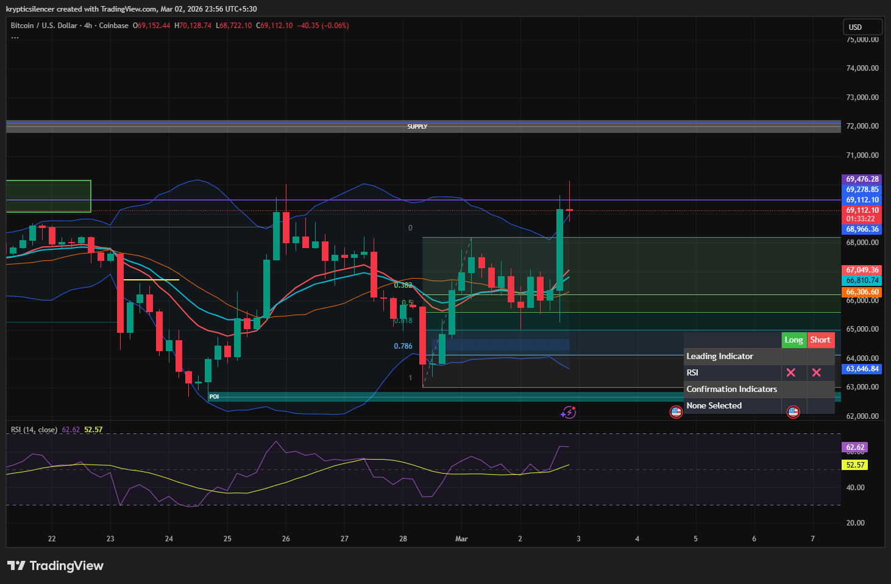

# Bitcoin — 4H Upper Bollinger Band Tag With Bullish Expansion

**Date:** 2026-03-02  
**Time:** ~23:55 IST  
**Instrument:** BTCUSD  
**Timeframe:** 4H  
**Venue:** Coinbase  
**Charting Platform:** TradingView  

---

## Context

Bitcoin rotated higher from local discount and reclaimed equilibrium within the broader 4H range.  
Price is now pushing into premium territory, approaching higher timeframe resistance overhead.

Momentum has accelerated into the upper volatility boundary.

---

## Observation

### 1️⃣ Upper Bollinger Band Tag
- Strong bullish candle expanded into the upper Bollinger Band.
- Volatility expansion evident after prior compression.
- Close near highs suggests aggressive buying pressure.

Band interaction signals short-term momentum strength.

### 2️⃣ Structural Position
- Higher low formed from recent swing.
- Price reclaimed 0.5–0.618 retracement zone.
- Currently testing upper range boundary near resistance.

Market shifting from balance toward expansion.

### 3️⃣ Momentum Condition
- RSI pushing into upper range (above midline).
- No immediate bearish divergence visible.
- Momentum aligned with bullish impulse.

### 4️⃣ Resistance Proximity
- Overhead supply remains near 69k–72k region.
- Current expansion approaching prior rejection zone.

---

## Hypothesis

Short-term structure favors continuation while momentum remains strong.

Two conditional paths:

### Scenario A — Continuation Into Resistance
Sustained acceptance above current highs could drive expansion toward higher timeframe supply.

### Scenario B — Volatility Reversion
Failure to hold above the upper band may trigger short-term pullback toward mid-band (equilibrium).

Until rejection is confirmed, momentum bias remains cautiously bullish.

---

## Invalidation / Confirmation

- Strong follow-through close above current highs → bullish continuation.
- Bearish engulfing / rejection candle at resistance → short-term pullback likely.

---

## Notes

This setup documents bullish expansion into the upper Bollinger Band, signaling volatility expansion and potential continuation toward higher timeframe resistance.

Text formatting and clarity were assisted by AI; the market analysis and structural interpretation are independently conducted by the author.  
This material is intended for educational and research documentation purposes only and does not constitute financial advice.
