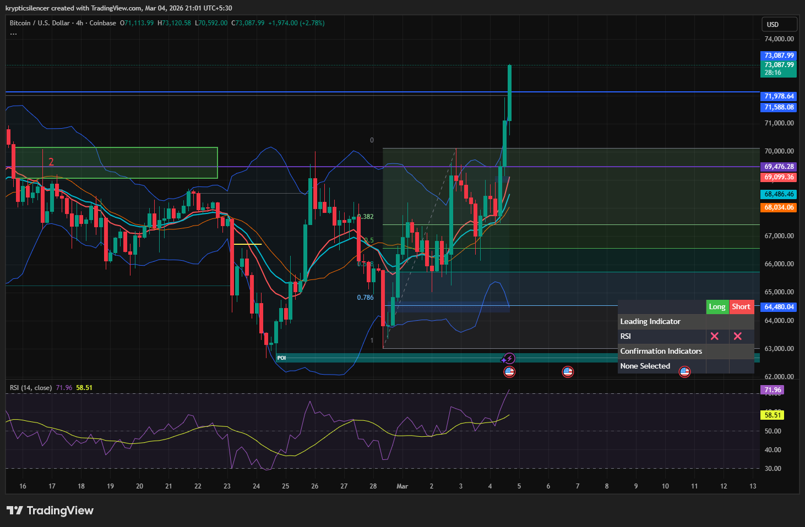

# Bitcoin — 4H Bullish Expansion Through Resistance

**Date:** 2026-03-04  
**Time:** ~21:00 IST  
**Instrument:** BTCUSD  
**Timeframe:** 4H  
**Venue:** Coinbase  
**Charting Platform:** TradingView  

---

## Context

Bitcoin transitioned from consolidation into a strong upside expansion after reclaiming mid-range structure.

The market moved impulsively from discount, breaking through prior resistance levels and pushing into higher timeframe liquidity.

Momentum has shifted decisively bullish on the 4H timeframe.

---

## Observation

### 1️⃣ Bullish Displacement
- Large impulsive candle broke through multiple resistance levels.
- Strong bullish body with minimal upper wick.
- Clear expansion beyond prior consolidation range.

This signals aggressive buyer participation.

### 2️⃣ Structure Shift
- Prior lower highs invalidated.
- New higher high established above previous resistance (~72k region).
- Structure transitioning toward bullish continuation.

### 3️⃣ Momentum Expansion
- RSI pushed into upper range (above 70).
- Momentum accelerating alongside price expansion.
- No immediate signs of bearish divergence.

### 4️⃣ Volatility Expansion
- Bollinger Bands widening during breakout.
- Price riding the upper band following displacement.
- Volatility regime shifting from compression to expansion.

---

## Hypothesis

Momentum favors bullish continuation while price holds above reclaimed resistance.

Two conditional paths:

### Scenario A — Continuation Toward Higher Liquidity
Acceptance above breakout levels could drive expansion toward higher timeframe supply zones.

### Scenario B — Breakout Retest
Short-term pullback to retest reclaimed resistance may occur before continuation.

As long as prior resistance holds as support, bullish structure remains intact.

---

## Invalidation / Confirmation

- Sustained price above breakout level → continuation confirmed.
- Loss of reclaimed resistance → potential false breakout and deeper retracement.

---

## Notes

This setup documents a strong bullish displacement following consolidation, with volatility and momentum expansion supporting continuation potential.

Text formatting and clarity were assisted by AI; the market analysis and structural interpretation are independently conducted by the author.  
This material is intended for educational and research documentation purposes only and does not constitute financial advice.
