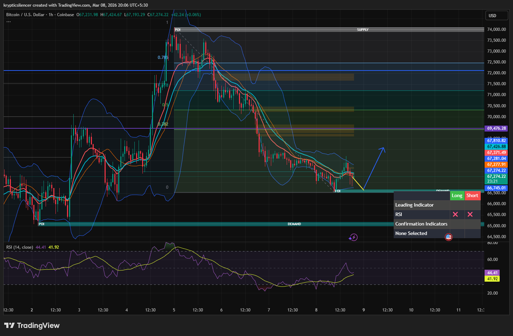

# Bitcoin — 1H Reaction at Key Demand, Short-Term Bounce Potential

**Date:** 2026-03-08  
**Time:** ~20:05 IST  
**Instrument:** BTCUSD  
**Timeframe:** 1H  
**Venue:** Coinbase  
**Charting Platform:** TradingView  

---

## Context

Bitcoin has been in a corrective decline after failing to sustain the prior bullish expansion.  
Price gradually rotated lower through multiple retracement levels and approached a higher timeframe demand zone.

The market is now reacting at this demand region.

---

## Observation

### 1️⃣ Demand Zone Interaction
- Price reached the marked **demand zone (~66.7k region)**.
- Immediate reaction formed with a short-term bounce.
- Lower wicks indicate buyers stepping in at support.

This suggests liquidity absorption at demand.

### 2️⃣ Short-Term Structure
- Downtrend sequence of lower highs remains intact.
- Current move resembles a relief bounce within the broader corrective trend.
- Price attempting to stabilize above local lows.

### 3️⃣ Bollinger Band Reaction
- Price tagged the **lower Bollinger Band** during the decline.
- Lower band interaction often precedes mean reversion.
- Current bounce aligning with volatility support.

### 4️⃣ Momentum Condition
- RSI recovering from lower levels (~40 region).
- Momentum shifting slightly upward but still neutral overall.
- No strong bullish expansion yet.

---

## Hypothesis

Price is reacting from demand, suggesting potential short-term recovery.

Two conditional paths:

### Scenario A — Relief Bounce
Sustained support at the demand zone may trigger a bounce toward equilibrium or nearby resistance zones above.

### Scenario B — Demand Failure
Loss of the demand level could invalidate the bounce and continue the broader downside rotation.

Until demand breaks, short-term upward reaction remains possible.

---

## Invalidation / Confirmation

- Higher low formation above demand → bounce continuation.
- Breakdown below demand → continuation toward deeper liquidity.

---

## Notes

This setup highlights a short-term reaction from a key demand zone following an extended corrective move.  
Demand interaction may produce a relief bounce before the next structural move develops.

Text formatting and clarity were assisted by AI; the market analysis and structural interpretation are independently conducted by the author.  
This material is intended for educational and research documentation purposes only and does not constitute financial advice.
