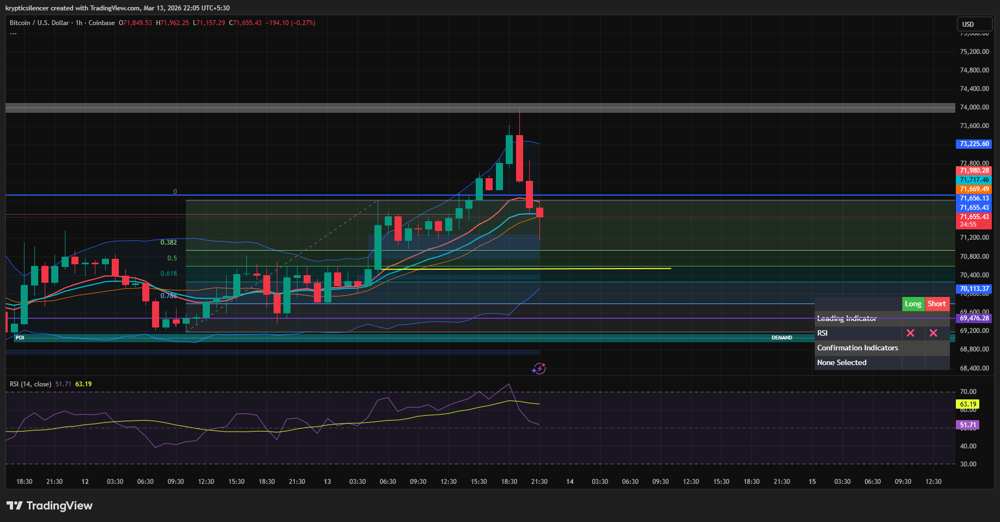

# Bitcoin — 1H Reversal After FVG Creation, Support Reaction Watch

**Date:** 2026-03-13  
**Time:** ~22:05 IST  
**Instrument:** BTCUSD  
**Timeframe:** 1H  
**Venue:** Coinbase  
**Charting Platform:** TradingView  

---

## Context

Bitcoin recently pushed into higher levels after a bullish expansion but encountered resistance near the upper range.  
Following the rejection, price printed several bearish candles, creating a **fair value gap (FVG)** during the move down.

Price is now approaching an internal support level marked by the yellow line.

---

## Observation

### 1️⃣ Fair Value Gap Formation
- The strong bearish displacement created an **inefficiency (FVG)**.
- This suggests a sudden imbalance between buyers and sellers.
- Such moves often lead to partial rebalancing before the next directional move.

### 2️⃣ Reversal Signal
- After reaching the local high, price formed consecutive bearish candles.
- Momentum shifted from bullish expansion to corrective pullback.
- Structure now testing the lower portion of the recent move.

### 3️⃣ Support Interaction
- Price approaching the **yellow horizontal support level**.
- This area previously acted as equilibrium within the structure.
- Potential reaction zone if buyers step in.

### 4️⃣ Momentum Condition
- RSI cooling from previous highs.
- Momentum shifting toward neutral after overextension.

---

## Hypothesis

Current structure suggests a short-term corrective move following the prior expansion.

Two conditional paths:

### Scenario A — Support Bounce
If price reacts positively from the **yellow support level**, a bounce toward equilibrium or the FVG region may occur.

### Scenario B — Support Breakdown
Failure to hold support could push price toward deeper demand levels below.

Until support is lost, a reaction from this level remains possible.

---

## Invalidation / Confirmation

- Bullish reaction at support → bounce toward mid-range levels.
- Breakdown below yellow support → continuation toward deeper demand.

---

## Notes

This setup highlights a **fair value gap created during a bearish displacement**, with price now approaching a key support level where a short-term bounce could occur.

Text formatting and clarity were assisted by AI; the market analysis and structural interpretation are independently conducted by the author.  
This material is intended for educational and research documentation purposes only and does not constitute financial advice.
