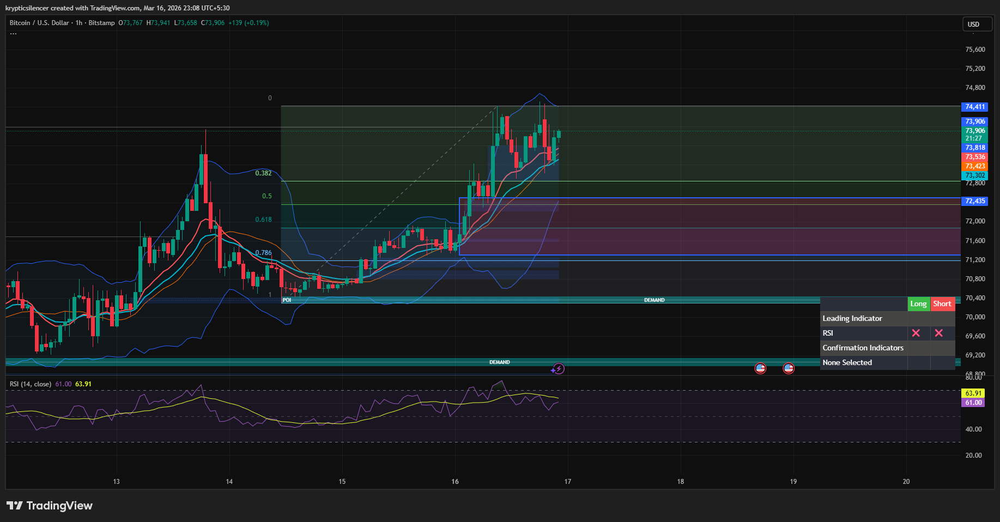

# Bitcoin — 1H Momentum Continuation With Potential FVG Retest

**Date:** 2026-03-16  
**Time:** ~23:05 IST  
**Instrument:** BTCUSD  
**Timeframe:** 1H  
**Venue:** Bitstamp  
**Charting Platform:** TradingView  

---

## Context

Bitcoin recently broke out of consolidation and printed a strong bullish expansion, pushing price toward the upper range of the current structure.

Momentum remains strong, but price is approaching supply where temporary inefficiencies may be rebalanced before continuation.

---

## Observation

### 1️⃣ Momentum Expansion
- Price has formed consecutive higher highs and higher lows.
- RSI currently around **60**, indicating sustained bullish momentum.
- Structure remains firmly bullish on the 1H timeframe.

### 2️⃣ Fair Value Gap Presence
- The recent bullish impulse created a **fair value gap (FVG)** below the current price.
- Markets frequently revisit these inefficiencies before continuing directional moves.

### 3️⃣ Resistance Interaction
- Price approaching a supply region near the upper range.
- Direct breakouts through supply without consolidation are less common.
- Short-term reaction or retracement often occurs before continuation.

### 4️⃣ Fibonacci Context
- Current move nearing the **0 Fibonacci extension level**.
- Price could briefly extend to this level before retracing.
- Alternatively, the retracement toward the FVG may occur before reaching the extension.

---

## Hypothesis

While momentum remains bullish, a short-term corrective move may occur to rebalance inefficiencies.

Two conditional paths:

### Scenario A — Extension Then Retrace
Price pushes toward the **0 Fibonacci level**, then pulls back toward the fair value gap before continuation.

### Scenario B — Immediate FVG Retest
Price retraces directly into the FVG to rebalance the inefficiency before resuming the bullish trend.

Momentum bias remains bullish unless key support breaks.

---

## Invalidation / Confirmation

- Strong continuation above resistance → bullish momentum expansion.
- Breakdown below FVG support → deeper retracement toward demand.

---

## Notes

Bitcoin often maintains momentum during bullish phases, but short-term rebalancing moves toward fair value gaps are common before continuation.

Text formatting and clarity were assisted by AI; the market analysis and structural interpretation are independently conducted by the author.  
This material is intended for educational and research documentation purposes only and does not constitute financial advice.
