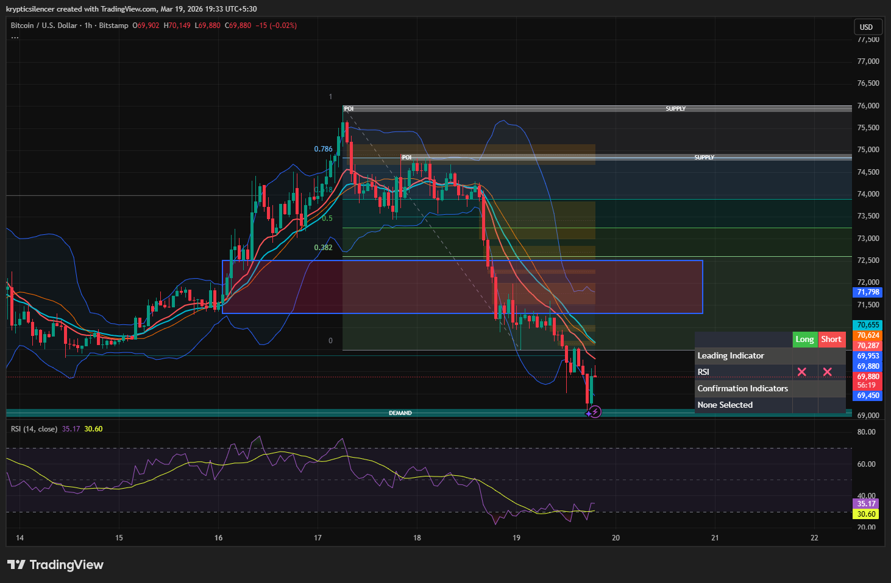

# Bitcoin — 1H Demand Bounce & Short-Term Bullish Reversal

**Date:** 2026-03-19  
**Time:** ~19:33 IST  
**Instrument:** BTCUSD  
**Timeframe:** 1H  
**Venue:** Bitstamp  
**Charting Platform:** TradingView  

---

## Context

Bitcoin has been in a short-term bearish move following rejection from higher supply.  
Price has now reached a key demand zone after a sustained sell-off.

---

## Observation

### 1️⃣ Demand Zone Interaction
- Price tapped a well-defined demand zone.
- Immediate reaction observed from this level.

### 2️⃣ Bollinger Band Signal
- Price touched the lower Bollinger Band.
- Indicates short-term oversold conditions.

### 3️⃣ RSI Behavior
- RSI near ~30, confirming oversold region.
- Momentum showing early signs of reversal.

### 4️⃣ Current Price Action
- Bullish reaction candle formed at demand.
- Potential shift from bearish pressure to short-term relief rally.

---

## Hypothesis

### Scenario A — Short-Term Bounce (Most Likely)
Price may move upward toward mid-range / EMA cluster before deciding next direction.

### Scenario B — Weak Bounce & Continuation
If buyers fail to sustain momentum, price may revisit or break demand.

---

## Invalidation / Confirmation

- Breakdown below demand → continuation of downtrend.
- Higher low formation → confirms short-term bullish structure.

---

## Notes

This setup highlights a classic oversold bounce from demand combined with Bollinger Band and RSI confluence.

Text formatting and clarity were assisted by AI; the market analysis and structural interpretation are independently conducted by the author.  
This material is intended for educational and research documentation purposes only and does not constitute financial advice.
