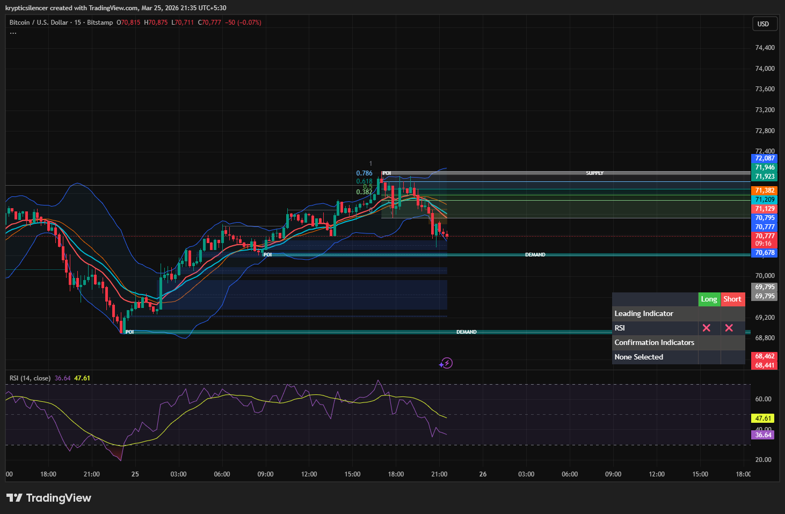

# Bitcoin — 15M Moving Into Demand Zone Decision Area

**Date:** 2026-03-25  
**Time:** ~21:35 IST  
**Instrument:** BTCUSD  
**Timeframe:** 15M  
**Venue:** Bitstamp  
**Charting Platform:** TradingView  

---

## Context

Bitcoin rejected from the upper supply region and has been moving downward in a short-term bearish move.  
Price is now approaching a key demand zone.

---

## Observation

### 1️⃣ Bearish Move From Supply
- Clear rejection from supply.
- Lower highs and lower lows forming on lower timeframe.

### 2️⃣ Demand Zone Below
- Price approaching nearest demand zone.
- This is a key reaction area.

### 3️⃣ RSI Behavior
- RSI around mid-to-low range (~36–47 earlier), showing weakening momentum.
- Not extremely oversold yet, so further move is possible.

### 4️⃣ Structure
- Short-term bearish structure intact.
- Price currently in a decision area (demand).

---

## Hypothesis

### Scenario A — Bounce From Demand
Price may react from the nearest demand zone and move back toward mid-range.

### Scenario B — Continue to Next Demand
If the nearest demand fails, price may continue downward to the next demand zone below.

---

## Invalidation / Confirmation

- Strong bullish reaction → confirms bounce.
- Clean break below demand → continuation downward.

---

## Notes

This is a classic demand reaction setup — the market is entering a decision zone where reaction determines the next move.

Text formatting and clarity were assisted by AI; the market analysis and structural interpretation are independently conducted by the author.  
This material is intended for educational and research documentation purposes only and does not constitute financial advice.
