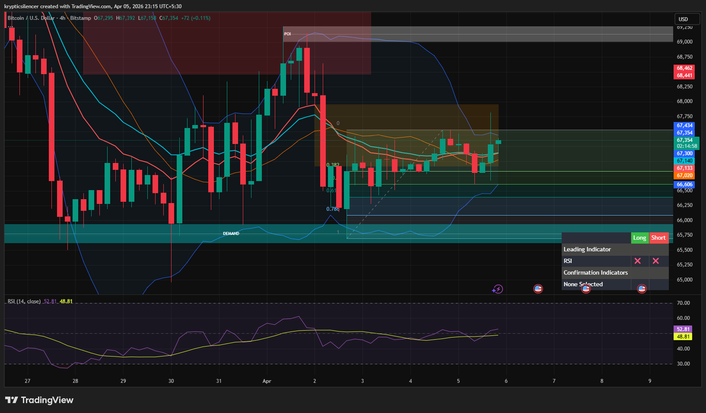

# Bitcoin — 4H Rebalancing After Impulsive Sell-Off

**Date:** 2026-04-05  
**Time:** ~23:15 IST  
**Instrument:** BTCUSD  
**Timeframe:** 4H  
**Venue:** Bitstamp  
**Charting Platform:** TradingView  

---

## Context

Bitcoin experienced an impulsive sell-off followed by a strong reaction from a higher timeframe demand zone. Price is currently consolidating and moving upward, indicating a rebalancing phase after the sharp downward move.

The broader structure remains cautious, but short-term price action shows recovery and stabilization above the recent lows.

---

## Observation

- **Market Structure:**  
  After the impulsive drop, price formed a higher low and is now consolidating in a range, indicating accumulation/rebalancing rather than immediate continuation down.

- **Fibonacci Retracement:**  
  Price is currently trading around the 0.382–0.5 retracement region of the recent impulsive move, an area often associated with consolidation before continuation.

- **Fair Value Gap (FVG):**  
  An inefficiency zone remains above current price, and price appears to be slowly moving upward to rebalance this area.

- **Demand Zone Reaction:**  
  Strong bullish reaction from the demand zone suggests active buyers at lower levels.

- **Momentum (RSI):**  
  RSI is gradually rising and holding around the midline, indicating strengthening bullish momentum without overbought conditions.

---

## Hypothesis

The current price action suggests a **rebalancing phase with slight bullish bias** toward the imbalance zone above.

Two conditional paths:

### Scenario 1 — Rebalancing Into FVG
If price continues forming higher lows and maintains momentum, price may move upward into the FVG/supply zone for rebalancing.

### Scenario 2 — Range Breakdown
If price fails to maintain higher low structure and breaks below the range support, the market may revisit the demand zone below.

---

## Invalidation / Failure Mode

- Breakdown below the recent higher low  
- Loss of range support and acceptance below it  
- RSI losing midline support and turning bearish  

---

## Notes

This analysis documents a **post-impulse rebalancing phase with mild bullish momentum**, not a confirmed bullish trend reversal.

Text formatting and clarity were assisted by AI; the market analysis, chart interpretation, and structural assessment are independently conducted by the author.  
This material is intended for educational and research documentation purposes only and does not constitute financial advice.
