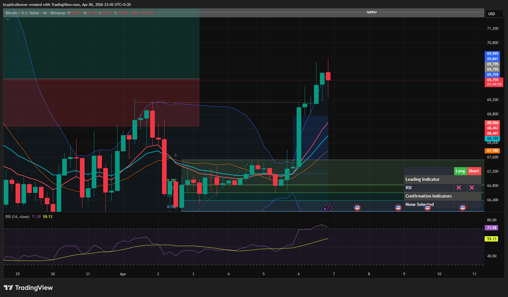

# Bitcoin — 4H Bullish Expansion Into Supply

**Date:** 2026-04-06  
**Time:** ~23:45 IST  
**Instrument:** BTCUSD  
**Timeframe:** 4H  
**Venue:** Bitstamp  
**Charting Platform:** TradingView  

---

## Context

Bitcoin previously experienced an impulsive sell-off into a demand zone, followed by a consolidation phase. Price has now broken out of the consolidation range and moved aggressively to the upside, indicating a bullish expansion phase and potential rebalancing toward higher timeframe supply.

---

## Observation

- **Market Structure:**  
  Price transitioned from consolidation to impulsive bullish expansion, breaking above the range and forming higher highs and higher lows on the lower timeframe.

- **Impulsive Move:**  
  A strong bullish impulse moved price away from the demand zone and above the consolidation range, indicating strong buying pressure.

- **Supply Zone:**  
  Price is now approaching a higher timeframe supply zone, where reactions are likely.

- **Momentum (RSI):**  
  RSI has moved into higher levels, indicating strong bullish momentum and expansion conditions.

- **Moving Averages:**  
  Price is now trading above key moving averages, which are beginning to slope upward, supporting bullish momentum.

---

## Hypothesis

The market is currently in a **bullish expansion phase** moving toward higher timeframe supply.

Two conditional paths:

### Scenario 1 — Supply Reaction
If price reacts from the higher timeframe supply zone, a pullback or consolidation may occur before the next move.

### Scenario 2 — Supply Break
If price breaks and holds above the supply zone, further bullish continuation and expansion may occur.

---

## Invalidation / Failure Mode

- Breakdown back into the previous consolidation range  
- Loss of higher low structure  
- RSI showing bearish divergence near supply  

---

## Notes

This analysis documents a **bullish expansion move into higher timeframe supply**, following a rebalancing and accumulation phase after the prior sell-off.

Text formatting and clarity were assisted by AI; the market analysis, chart interpretation, and structural assessment are independently conducted by the author.  
This material is intended for educational and research documentation purposes only and does not constitute financial advice.
