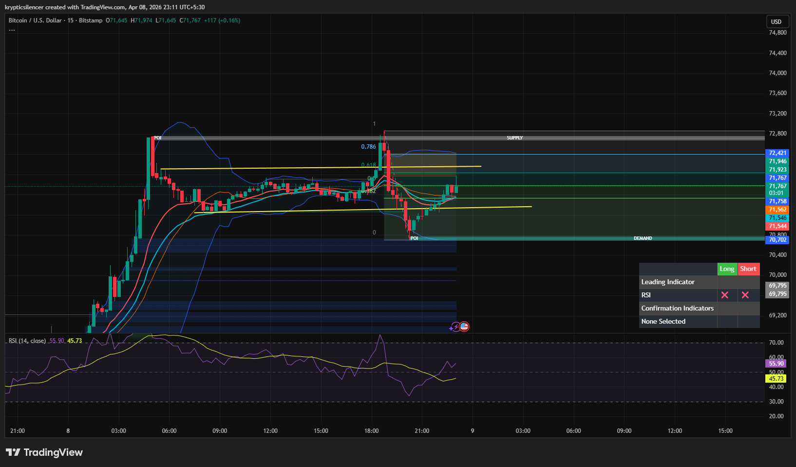

# Bitcoin — 15M Rejection From Supply After Rebalancing

**Date:** 2026-04-08  
**Time:** ~23:11 IST  
**Instrument:** BTCUSD  
**Timeframe:** 15M  
**Venue:** Bitstamp  
**Charting Platform:** TradingView  

---

## Context

Bitcoin showed a strong bullish expansion earlier, followed by a move into a higher timeframe supply zone. After tapping this region, price faced rejection and is now pulling back, indicating a short-term shift from expansion to retracement.

---

## Observation

- **Market Structure:**  
  Short-term structure shows a rejection from the recent high, followed by a pullback and attempt to stabilize above a minor support zone.

- **Supply Interaction:**  
  Price tapped the 0.786 retracement aligned with a supply zone (~72.4k) and faced immediate rejection.

- **Retracement Behavior:**  
  Price retraced toward the 0.382–0.5 region and is attempting to consolidate, suggesting a potential base formation.

- **Demand Zone:**  
  A nearby demand zone (~70.7k) remains the key support, where prior buying interest was observed.

- **Momentum (RSI):**  
  RSI dropped from higher levels and is now recovering from lower zones, indicating cooling momentum with potential stabilization.

---

## Hypothesis

The market is currently in a **post-rejection retracement phase** after tapping supply.

Two conditional paths:

### Scenario 1 — Range Stabilization
If price holds above the mid-range support and forms higher lows, consolidation may continue before another attempt toward supply.

### Scenario 2 — Deeper Pullback
If price loses current support, a move toward the demand zone (~70.7k) is likely before any further upside attempt.

---

## Invalidation / Failure Mode

- Break above supply zone with strong acceptance  
- Formation of higher highs on lower timeframe  
- RSI reclaiming strong bullish momentum  

---

## Notes

This analysis documents a **short-term rejection from supply followed by retracement**, not a confirmed trend reversal on higher timeframes.

Text formatting and clarity were assisted by AI; the market analysis, chart interpretation, and structural assessment are independently conducted by the author.  
This material is intended for educational and research documentation purposes only and does not constitute financial advice.
