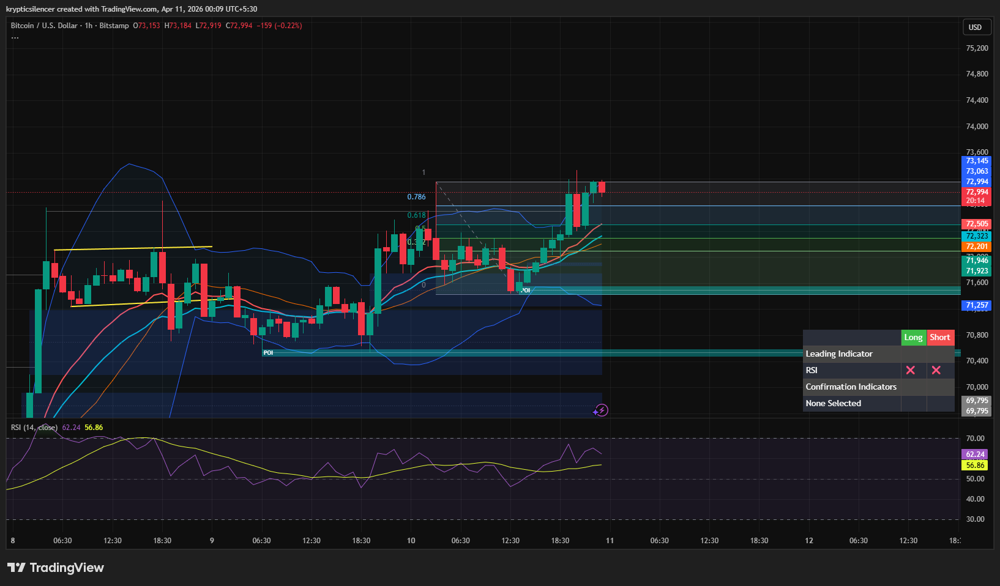

# Bitcoin — 1H Bullish Continuation Into Supply

**Date:** 2026-04-11  
**Time:** ~00:09 IST  
**Instrument:** BTCUSD  
**Timeframe:** 1H  
**Venue:** Bitstamp  
**Charting Platform:** TradingView  

---

## Context

Bitcoin has transitioned into a bullish phase after holding a demand zone and forming higher lows. Price is now pushing upward and approaching a higher timeframe supply region, indicating continuation of bullish momentum.

---

## Observation

- **Market Structure:**  
  Bullish structure with higher highs and higher lows, confirming short-term trend continuation.

- **Breakout Behavior:**  
  Price broke out of prior consolidation and continued upward, showing sustained buying pressure.

- **Fibonacci Retracement:**  
  Price is holding above the 0.5–0.618 retracement region, reinforcing bullish continuation.

- **Supply Zone:**  
  Price is currently testing a supply zone (~73k), where reaction is likely.

- **Momentum (RSI):**  
  RSI remains above midline and trending upward, indicating strong bullish momentum.

- **Moving Averages:**  
  Price is trading above key moving averages, which are aligned bullishly.

---

## Hypothesis

The market is in a **bullish continuation phase into supply**.

Two conditional paths:

### Scenario 1 — Supply Reaction
If price reacts from the supply zone, a pullback toward the 0.5–0.618 region may occur before continuation.

### Scenario 2 — Breakout Continuation
If price breaks and holds above supply, further upside expansion is likely.

---

## Invalidation / Failure Mode

- Breakdown below 0.5 retracement region  
- Loss of higher low structure  
- RSI dropping below midline  

---

## Notes

This analysis documents a **bullish continuation move into supply**, not a confirmed breakout beyond higher timeframe resistance.

Text formatting and clarity were assisted by AI; the market analysis, chart interpretation, and structural assessment are independently conducted by the author.  
This material is intended for educational and research documentation purposes only and does not constitute financial advice.
