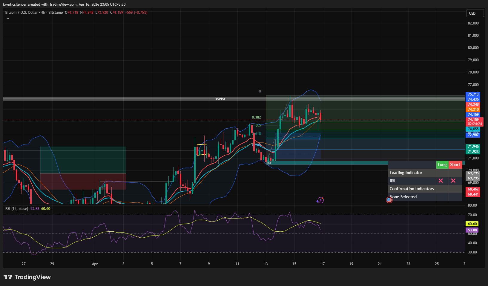

# Bitcoin — 4H Bearish Reversal Setup After FVG Formation

**Date:** 2026-04-16  
**Time:** ~23:05 IST  
**Instrument:** BTCUSD  
**Timeframe:** 4H  
**Venue:** Bitstamp  
**Charting Platform:** TradingView  

---

## Context

Bitcoin recently pushed into a higher timeframe supply zone with strong bullish momentum. Following this expansion, price formed a local top and began consolidating, indicating potential exhaustion. A large imbalance (FVG) has been created during the impulsive move.

---

## Observation

- **Market Structure:**  
  Short-term structure shows signs of weakening after bullish expansion, with price failing to continue higher and beginning to compress.

- **FVG Formation:**  
  The impulsive bullish move created a large FVG below current price, which now acts as a magnet for price.

- **Supply Zone:**  
  Price is reacting within a higher timeframe supply region (~74.5k–75k), where selling pressure is evident.

- **Rejection Signs:**  
  Multiple wicks and inability to break higher suggest exhaustion near the top.

- **Momentum (RSI):**  
  RSI is rolling over from higher levels, indicating weakening bullish momentum and potential bearish shift.

---

## Hypothesis

The market is showing a **short-term bearish reversal setup**, with price likely to rebalance the inefficiency below.

Two conditional paths:

### Scenario 1 — FVG Rebalance (Bearish Move)
If price continues to reject from supply, a move downward into the FVG (~72–73k region) is likely.

### Scenario 2 — Continuation Failure
If price breaks above supply and holds, the bearish setup is invalid and bullish continuation may occur.

---

## Invalidation / Failure Mode

- Strong breakout and acceptance above supply zone  
- Formation of higher highs beyond current range  
- RSI reclaiming strong bullish momentum  

---

## Notes

This analysis documents a **potential bearish reversal driven by imbalance rebalancing**, not a confirmed higher timeframe trend reversal.

Text formatting and clarity were assisted by AI; the market analysis, chart interpretation, and structural assessment are independently conducted by the author.  
This material is intended for educational and research documentation purposes only and does not constitute financial advice.
