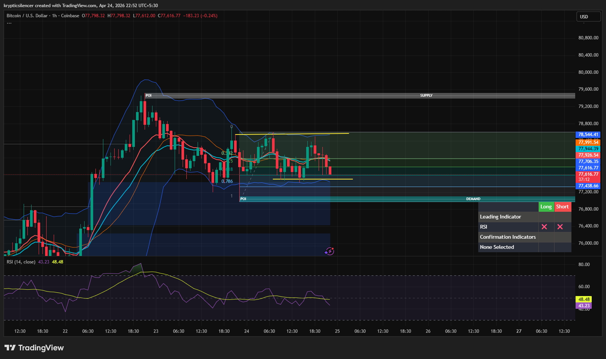

# Bitcoin — 1H Range Compression & Key Level Reaction

**Date:** 2026-04-24  
**Time:** ~22:50 IST  
**Instrument:** BTCUSD  
**Timeframe:** 1H  
**Venue:** Coinbase  
**Charting Platform:** TradingView  

---

## Context

Bitcoin is currently consolidating after a prior impulsive move, forming a tight intraday range.  
Price is reacting within a defined structure, with clearly marked key levels acting as decision zones.

---

## Observation

- **Market Structure:**  
  Short-term range-bound behavior following an impulsive leg. No clear breakout yet.

- **Key Levels (Yellow):**  
  Price is oscillating between marked resistance and support. These levels are acting as immediate triggers for directional expansion.

- **Compression:**  
  Reduced volatility and overlapping candles indicate buildup before a move.

- **Momentum (RSI):**  
  RSI is neutral and drifting lower, reflecting lack of strong momentum in either direction.

---

## Hypothesis

The next directional move is likely to be determined by which key level is taken out first.

### Scenario 1 — Bullish Break
If price breaks above the upper yellow resistance with acceptance, continuation toward higher supply becomes likely.

### Scenario 2 — Bearish Breakdown
If price loses the lower yellow support, downside expansion toward demand zones is expected.

---

## Invalidation / Failure Mode

- Failed breakout with immediate rejection back into range  
- Lack of follow-through after level breach  
- Continued chop within the range without expansion  

---

## Notes

This setup reflects **range compression with level-based breakout potential**, not a confirmed directional bias yet.

Text formatting and clarity were assisted by AI; the market analysis, chart interpretation, and structural assessment are independently conducted by the author.  
This material is intended for educational and research documentation purposes only and does not constitute financial advice.
