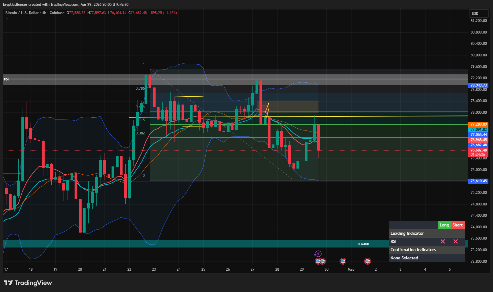

# Bitcoin — 4H Rejection at Mid-Range Resistance

**Date:** 2026-04-29  
**Time:** ~20:05 IST  
**Instrument:** BTCUSD  
**Timeframe:** 4H  
**Venue:** Coinbase  
**Charting Platform:** TradingView  

---

## Context

Bitcoin attempted a short-term recovery after reacting from local lows, but price has now met resistance near the mid-range zone and printed a sharp rejection.

The broader structure remains rotational, with price still trapped between higher supply and lower demand.

---

## Observation

- **Market Structure:**  
  Price remains inside a wider range, with no confirmed breakout on either side.

- **Mid-Range Rejection:**  
  BTC pushed into the marked resistance zone and was rejected immediately, showing sellers are still active near this level.

- **Key Levels:**  
  Upper resistance remains intact near the yellow-marked level, while downside support sits near the lower boundary of the range.

- **Momentum (RSI):**  
  RSI remains neutral and lacks strong directional conviction, supporting continued range behavior unless expansion follows.

---

## Hypothesis

Bitcoin remains in a rotational structure unless price reclaims resistance or breaks lower support.

### Scenario 1 — Bullish Reclaim
If BTC reclaims the rejected resistance zone and holds above it, continuation toward upper supply becomes likely.

### Scenario 2 — Bearish Continuation
Failure to reclaim resistance increases the probability of rotation back toward lower range support and potentially deeper demand.

---

## Invalidation / Failure Mode

- Strong reclaim above the rejected resistance zone  
- Breakdown below lower range support without reaction  
- Continued chop inside the range with no directional expansion  

---

## Notes

This setup reflects **range rotation with bearish rejection at resistance**, not a confirmed trend reversal.

Text formatting and clarity were assisted by AI; the market analysis, chart interpretation, and structural assessment are independently conducted by the author.  
This material is intended for educational and research documentation purposes only and does not constitute financial advice.
