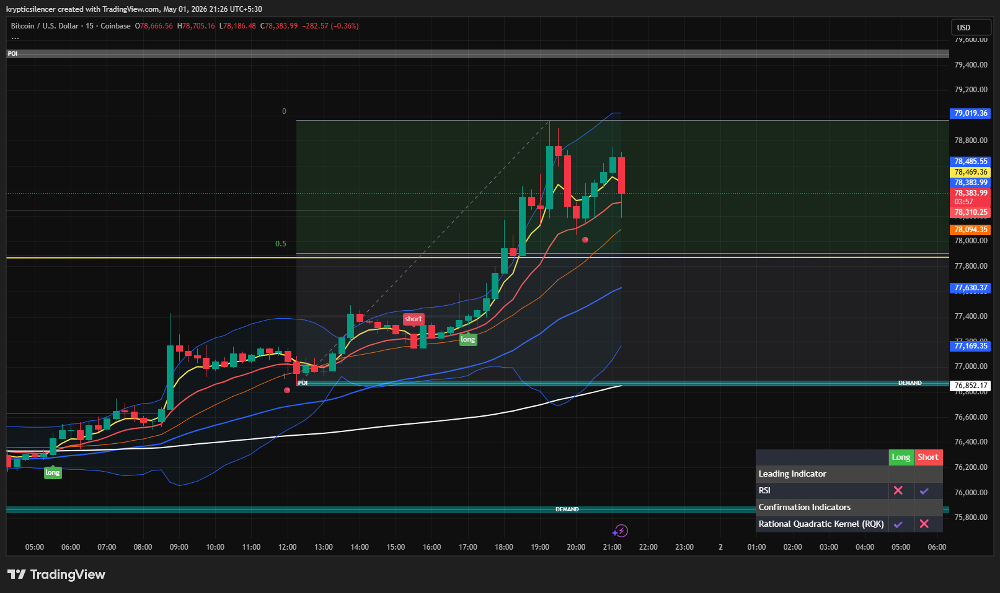

# Bitcoin — 15M Local Exhaustion Near Intraday High

**Date:** 2026-05-01  
**Time:** ~21:25 IST  
**Instrument:** BTCUSD  
**Timeframe:** 15M  
**Venue:** Coinbase  
**Charting Platform:** TradingView  

---

## Context

Bitcoin has printed a strong intraday expansion and is now trading near local highs after an extended bullish move.

Price remains structurally strong, but short-term momentum appears stretched as BTC trades away from immediate support.

---

## Observation

- **Market Structure:**  
  Strong intraday bullish continuation with clear short-term trend control.

- **Local Exhaustion:**  
  Price is stalling near the local high after an impulsive expansion, suggesting temporary exhaustion.

- **Yellow Support:**  
  The marked yellow level is acting as the nearest key support and likely short-term rebalance zone.

- **Momentum (RSI):**  
  RSI remains elevated after the expansion, indicating short-term overextension despite bullish structure.

---

## Hypothesis

Bitcoin remains bullish intraday, but short-term price is likely to rebalance before continuation.

### Scenario 1 — Pullback to Support
A short-term retrace into the yellow support zone is likely before the next directional move.

### Scenario 2 — Continuation
If BTC holds above the yellow level without deeper pullback, continuation toward higher intraday resistance remains possible.

---

## Invalidation / Failure Mode

- Immediate breakdown below yellow support  
- Loss of short-term structure after pullback  
- Sharp rejection with no bullish recovery from support  

---

## Notes

This setup reflects **short-term exhaustion after bullish expansion**, with a probable retrace into support before continuation.

Text formatting and clarity were assisted by AI; the market analysis, chart interpretation, and structural assessment are independently conducted by the author.  
This material is intended for educational and research documentation purposes only and does not constitute financial advice.
