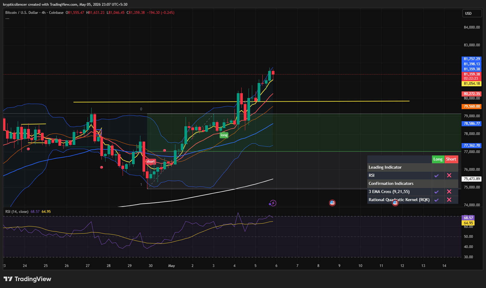

# Bitcoin — 4H Short-Term Pullback Before Continuation

**Date:** 2026-05-05  
**Time:** 23:07 IST  
**Instrument:** BTCUSD  
**Timeframe:** 4H  
**Venue:** Coinbase  
**Charting Platform:** TradingView  

---

## Context

Bitcoin is showing a minor bearish reaction after a strong impulsive move into local highs. Price has pushed into resistance and is now displaying short-term exhaustion, suggesting a local cooldown before the next major directional expansion.

---

## Observation

- **Market Structure:**  
Short-term bullish structure remains intact, but momentum is cooling after an extended upside push.

- **Resistance / Reaction Zone:**  
Price is reacting near local resistance around the recent highs (~81.3k–81.7k), where rejection pressure is beginning to emerge.

- **Support Zone:**  
The yellow marked support (~79.8k–80k) remains the key level. This acts as the first major reclaim zone if price pulls back.

- **Momentum Shift:**  
RSI is elevated and beginning to flatten, indicating short-term exhaustion and a possible momentum reset.

- **Trend Condition:**  
Price remains above key EMAs and broader bullish structure is still intact, favoring continuation after correction.

---

## Hypothesis

The market is likely entering a **short-term pullback / reset phase** before continuation.

Two conditional paths:

### Scenario 1 — Pullback Then Continuation  
If BTC retraces into the yellow support zone and holds, a bullish continuation toward higher resistance is likely after local re-accumulation.

### Scenario 2 — Deeper Correction  
If support fails to hold, price may rotate lower into the broader value area before attempting another bullish expansion.

---

## Invalidation / Failure Mode

- Breakdown below yellow support with acceptance  
- Loss of short-term bullish EMA structure  
- RSI weakening sharply below mid-range  
- Failure to reclaim support after pullback

---

## Notes

This analysis reflects a short-term cooling phase within a broader bullish structure. Current weakness appears corrective unless support fails decisively. The primary focus is on how price reacts at the yellow support zone, which will determine whether BTC resumes higher or enters a deeper reset.

This material is intended for educational and observational purposes only and does not constitute financial advice.
