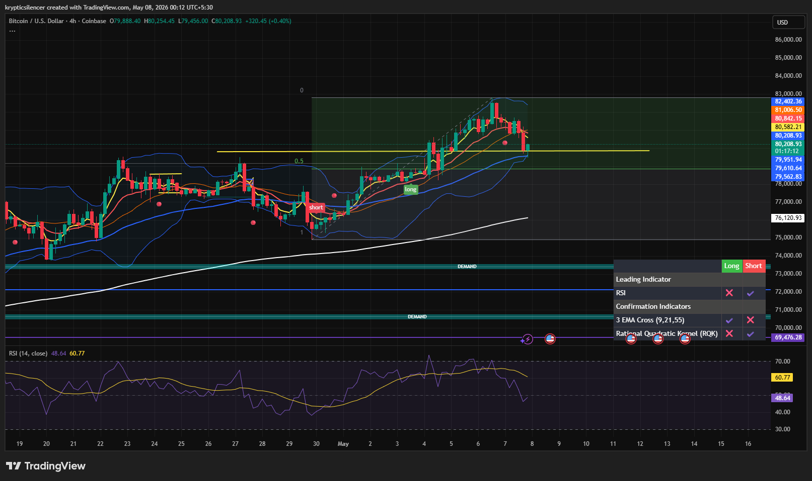

# Bitcoin — 4H Pullback Into Key Support

**Date:** 2026-05-08  
**Time:** 00:12 IST  
**Instrument:** BTCUSD  
**Timeframe:** 4H  
**Venue:** Coinbase  
**Charting Platform:** TradingView  

---

## Context

Bitcoin is undergoing a short-term pullback after a strong impulsive rally into local highs. Price has rotated back toward the highlighted yellow support region, where buyers are expected to react if the broader bullish structure remains intact.

---

## Observation

- **Market Structure:**  
Higher timeframe bullish structure remains valid despite the recent rejection from local highs.

- **Support Zone:**  
BTC is currently testing the yellow marked support area (~79.9k–80.2k), which aligns with mid-range structure and short-term EMA support.

- **Resistance Zone:**  
Recent highs near ~81k–82k continue acting as local resistance after the failed breakout attempt.

- **Momentum Condition:**  
RSI has cooled sharply from elevated levels and is now approaching neutral territory, reflecting weakening short-term momentum.

- **Trend Condition:**  
Price remains above broader trend support and the higher timeframe bullish structure is still preserved unless support breaks decisively.

---

## Hypothesis

BTC is likely entering a **short-term reset phase** after overextension into resistance.

Two conditional paths:

### Scenario 1 — Support Hold Then Continuation  
If the yellow support region holds, BTC may stabilize and continue higher toward the recent highs after momentum resets.

### Scenario 2 — Breakdown Into Deeper Correction  
If support fails with strong bearish acceptance, price may rotate lower into the broader value area before another bullish attempt.

---

## Invalidation / Failure Mode

- Breakdown below yellow support with acceptance  
- Loss of short-term EMA structure  
- RSI sustaining below neutral without recovery  
- Failure to reclaim support after breakdown

---

## Notes

Current weakness appears corrective rather than fully bearish, as BTC is retracing into a major support region after an extended rally. The next reaction around the yellow support zone will likely determine whether this remains a healthy pullback or evolves into a deeper correction.

This material is intended for educational and observational purposes only and does not constitute financial advice.
