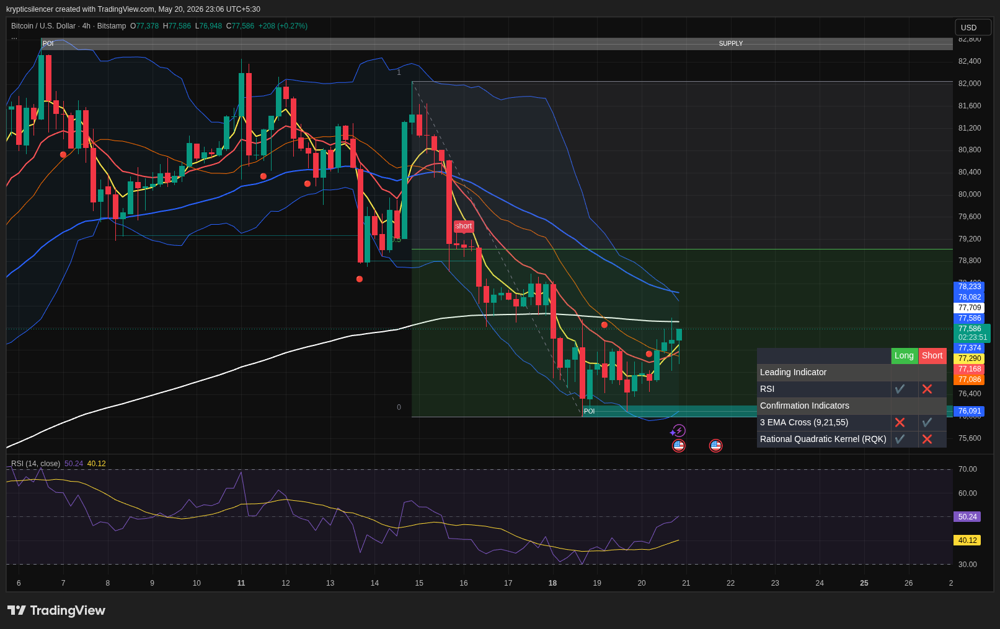

# BTC — 4H Bullish Expansion Toward Resistance

**Date:** 2026-05-20  
**Time:** 23:06 IST  
**Instrument:** BTCUSD  
**Timeframe:** 4H  
**Venue:** Coinbase  
**Charting Platform:** TradingView  

---

## Context

Bitcoin continues showing strong bullish momentum after reclaiming local structure and holding above key moving averages. Buyers remain in control as price pushes toward higher timeframe resistance.

---

## Observation

- **Market Structure:**  
Higher highs and higher lows continue forming, confirming bullish continuation structure.

- **Momentum:**  
RSI remains elevated with bullish momentum still active and no major signs of exhaustion yet.

- **EMA Structure:**  
Short-term EMAs remain stacked bullishly, supporting continuation toward higher resistance zones.

- **Resistance Zone:**  
Price is approaching a key resistance area where previous supply reactions occurred.

- **Volatility:**  
Expansion from recent consolidation suggests increasing directional strength from buyers.

---

## Hypothesis

BTC remains in a bullish continuation phase with momentum favoring further upside.

### Scenario 1 — Continuation
If price sustains above current support and reclaims resistance, continuation toward higher liquidity zones becomes likely.

### Scenario 2 — Pullback
Failure to maintain momentum near resistance may trigger a short-term retracement into EMA support before continuation.

---

## Invalidation / Failure Mode

- Breakdown below local support structure  
- Loss of bullish EMA alignment  
- RSI momentum sharply weakening below midline  

---

## Notes

Current structure strongly favors buyers while momentum remains supportive. Volatility may increase as BTC approaches higher timeframe resistance.

This analysis is for educational and observational purposes only and does not constitute financial advice.
