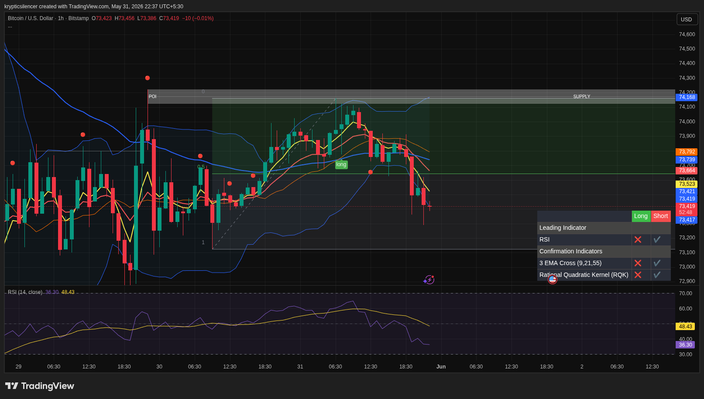

# Bitcoin — 1H Breakdown From Range High Into Local Support

**Date:** 2026-05-31
**Time:** ~22:37 IST
**Instrument:** BTCUSD
**Timeframe:** 1H
**Venue:** Bitstamp
**Charting Platform:** TradingView

---

## Context

Bitcoin attempted to maintain its recovery structure after rebounding from local lows but failed to sustain momentum near the upper half of the range.

Following rejection beneath the higher timeframe supply region, price rotated lower and broke below short-term support, returning toward the lower portion of the active trading range.

---

## Observation

### 1️⃣ Range High Rejection

* Price advanced toward the upper boundary of the range but failed to reach supply.
* Multiple rejection candles formed near local resistance.
* Buyers lost momentum before achieving a breakout.

The inability to challenge higher resistance suggests weakening bullish pressure.

### 2️⃣ EMA Breakdown

* Price has fallen beneath the short-term EMA cluster.
* Fast EMAs are beginning to roll over.
* Dynamic support has transitioned into resistance.

This signals deterioration in short-term market structure.

### 3️⃣ Momentum Weakness

* RSI has declined toward the mid-30 region.
* Momentum continues making lower highs after the recent peak.
* No bullish divergence is currently visible.

Momentum favors sellers in the immediate term.

### 4️⃣ Position Within Range

* Price remains above major range support despite the selloff.
* Current movement appears to be a rotation from range highs toward equilibrium.
* Lower support remains the key area to monitor.

The broader range structure remains intact despite short-term weakness.

---

## Hypothesis

Bitcoin is showing signs of short-term bearish continuation while remaining inside a larger consolidation range.

Two conditional paths remain active:

### Scenario A — Bearish Continuation

Failure to reclaim the EMA cluster could lead to a revisit of lower range support and potential liquidity below recent lows.

### Scenario B — Support Reaction

If buyers defend the current support region and reclaim nearby EMAs, price could rotate back toward range resistance and attempt another recovery leg.

Until bullish structure is reclaimed, short-term momentum favors sellers.

---

## Invalidation / Confirmation

* Reclaim of EMA resistance and higher highs → bearish thesis weakens.
* Breakdown below local support → continuation confirmed.
* Strong reaction from support followed by bullish structure shift → recovery scenario gains validity.

---

## Notes

This setup reflects a range-bound market experiencing a rejection from its upper half, followed by a bearish rotation back toward support. Current momentum and EMA positioning favor caution until buyers demonstrate renewed strength.

Text formatting and clarity were assisted by AI; the market analysis and structural interpretation are independently conducted by the author.
This material is intended for educational and research documentation purposes only and does not constitute financial advice.
