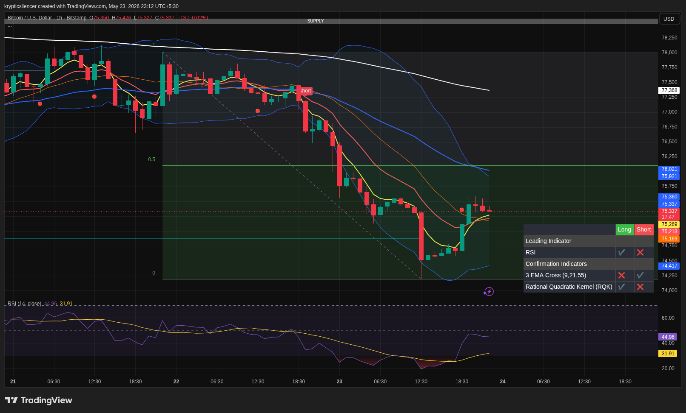

# BTC — 1H Recovery Attempt After Sharp Selloff

**Date:** 2026-05-23  
**Time:** 23:12 IST  
**Instrument:** BTCUSD  
**Timeframe:** 1H  
**Venue:** Bitstamp  
**Charting Platform:** TradingView  

---

## Context

Bitcoin experienced a sharp intraday selloff before finding temporary support near local demand. Price is now attempting a short-term recovery, though broader structure remains weak beneath higher timeframe resistance.

---

## Observation

- **Market Structure:**  
Lower highs and lower lows continue dominating short-term structure despite the recent bounce.

- **Demand Reaction:**  
Buyers stepped in aggressively near local lows, creating a relief recovery from oversold conditions.

- **Momentum:**  
RSI recovered sharply from deeply oversold territory, signaling improving short-term momentum.

- **EMA Structure:**  
Price remains below major EMA resistance levels, keeping broader bearish pressure active.

- **Volatility:**  
Recent expansion in volatility suggests heightened uncertainty and reactive price movement.

---

## Hypothesis

BTC is currently attempting a relief recovery inside a broader bearish intraday structure.

### Scenario 1 — Recovery Continuation
If price reclaims nearby EMA resistance, a move toward higher resistance zones becomes possible.

### Scenario 2 — Rejection
Failure to reclaim resistance may lead to continuation toward lower support levels.

---

## Invalidation / Failure Mode

- Strong reclaim above higher timeframe resistance  
- Bullish EMA crossover with sustained momentum  
- RSI reclaiming bullish territory above midline  

---

## Notes

Current recovery appears reactive rather than structurally bullish for now. Broader short-term pressure remains bearish unless BTC reclaims key resistance clusters.

This analysis is for educational and observational purposes only and does not constitute financial advice.
