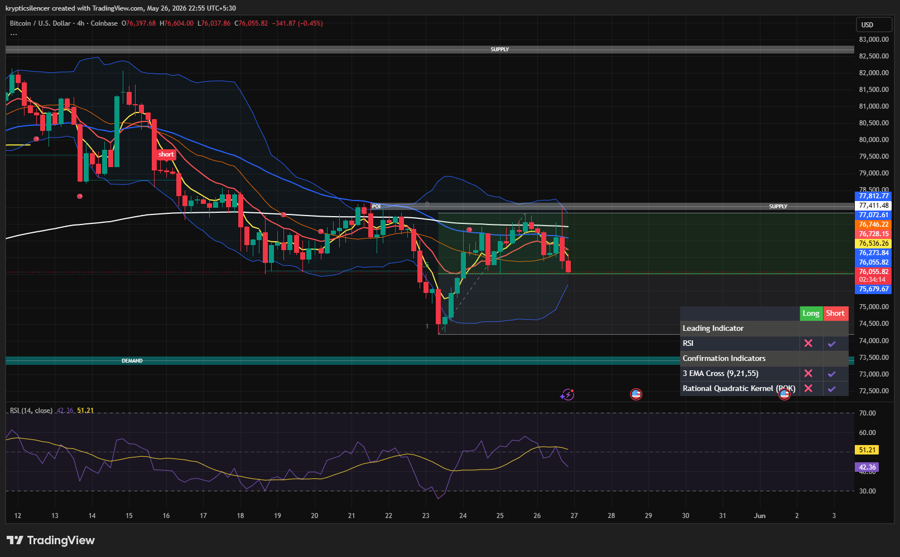

# Bitcoin — 4H Supply Rejection Within Range Structure

**Date:** 2026-05-26
**Time:** ~22:55 IST
**Instrument:** BTCUSD
**Timeframe:** 4H
**Venue:** Coinbase
**Charting Platform:** TradingView

---

## Context

Bitcoin remains inside a broader corrective range after a strong downside expansion earlier in the month.

Price attempted recovery from the recent demand reaction low but failed to reclaim higher timeframe supply overhead. The market is currently rotating back downward from resistance while remaining trapped inside a visible equilibrium structure.

---

## Observation

### 1️⃣ Supply Zone Rejection

* Price rallied directly into marked 4H supply.
* Multiple candles showed rejection near the upper boundary.
* Buyers failed to establish acceptance above resistance.

This suggests supply remains active.

### 2️⃣ EMA Structure

* Short-term EMAs remain bearishly compressed.
* Price continues trading below the higher EMA cluster and major moving average resistance.
* Dynamic resistance remains respected during rallies.

Momentum recovery appears weak rather than impulsive.

### 3️⃣ Range Positioning

* Current structure resembles a mid-range rotation after the local bounce from demand.
* Price is drifting away from equilibrium toward the lower half of the range.
* No confirmed breakout structure has formed yet.

This keeps the market in rotational conditions rather than trend continuation.

### 4️⃣ RSI Behavior

* RSI rolled over near mid-range territory.
* Momentum failed to enter strong bullish expansion zones.
* Current RSI positioning favors weakening upside pressure.

---

## Hypothesis

Bitcoin remains structurally neutral-to-bearish while below the 4H supply region.

Two conditional paths remain active:

### Scenario A — Bearish Rotation

Failure to reclaim supply could lead to continuation toward lower range liquidity and potential revisit of the demand region near recent lows.

### Scenario B — Supply Reclaim

Strong acceptance above supply and EMA resistance would invalidate immediate bearish pressure and open the possibility of bullish range expansion.

Until resistance is reclaimed decisively, short-term bias favors rejection continuation.

---

## Invalidation / Confirmation

* Sustained breakout above supply → bearish thesis weakens.
* Lower high formation followed by downside continuation → bearish rotation confirmed.
* Revisit of lower demand region → range continuation validated.

---

## Notes

This setup reflects a classic range rotation structure with rejection from higher timeframe supply and continued weakness beneath dynamic EMA resistance.

Text formatting and clarity were assisted by AI; the market analysis and structural interpretation are independently conducted by the author.
This material is intended for educational and research documentation purposes only and does not constitute financial advice.
