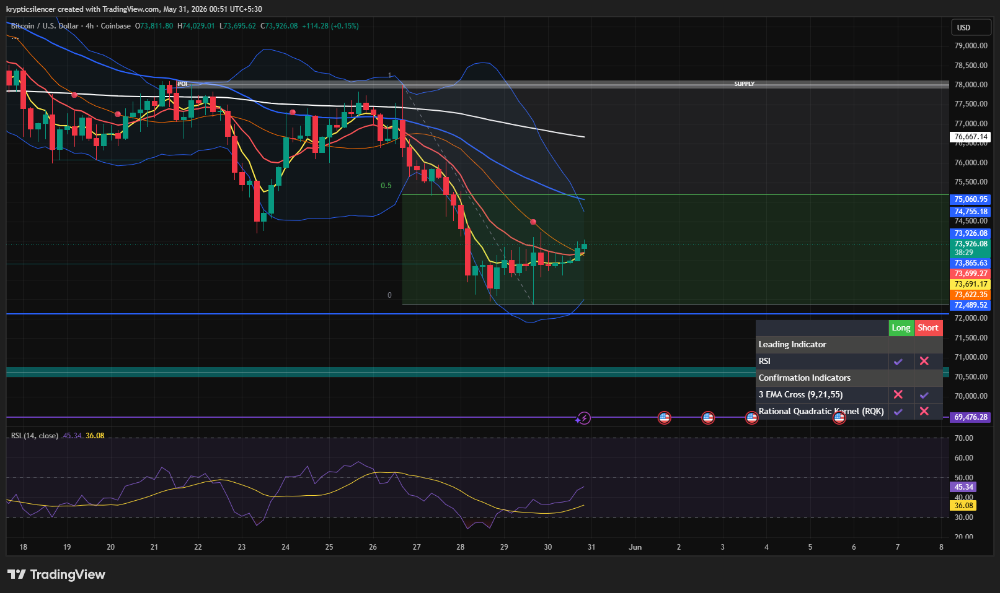

# Bitcoin — 4H Range Consolidation After Impulse Decline

**Date:** 2026-05-31
**Time:** ~00:51 IST
**Instrument:** BTCUSD
**Timeframe:** 4H
**Venue:** Coinbase
**Charting Platform:** TradingView

---

## Context

Bitcoin is consolidating after a sharp bearish impulse that drove price into the lower boundary of the current range.

Following the plunge, price has stabilized above local support and is now trading sideways beneath major resistance. Market participation appears subdued, with neither buyers nor sellers demonstrating decisive control.

---

## Observation

### 1️⃣ Range Structure

* Price rebounded from the 72.4k region after the recent selloff.
* Current action remains confined within a defined range.
* Resistance is located near the 75.4k area, while support extends through the 72k–74k region.

The market is currently rotating inside this range without a confirmed directional breakout.

### 2️⃣ EMA Recovery Attempt

* Short-term EMAs are beginning to flatten after the decline.
* Price has reclaimed some fast-moving averages but remains below higher dynamic resistance.
* No bullish EMA expansion has formed yet.

This suggests recovery momentum remains limited.

### 3️⃣ Momentum Conditions

* RSI has recovered from oversold territory.
* Momentum improved from panic-selling conditions but remains below strong bullish levels.
* Current readings indicate stabilization rather than trend reversal.

Buyers have slowed the decline but have not established dominance.

### 4️⃣ Market Participation

* Recent candles show reduced volatility compared to the impulsive drop.
* Consolidation is occurring on relatively weak momentum.
* Price continues to respect the established support and resistance boundaries.

This behavior is consistent with accumulation of liquidity before a larger directional move.

---

## Hypothesis

Bitcoin is likely to remain range-bound while trading between key support and resistance levels.

Two conditional paths remain active:

### Scenario A — Bullish Breakout

A sustained move above 75.4k resistance would indicate renewed demand and could trigger expansion toward higher liquidity zones and supply overhead.

### Scenario B — Bearish Continuation

Failure to maintain support within the 72k–74k region would expose lower liquidity and potentially resume the broader bearish structure.

Until either boundary is decisively broken, the most probable outcome remains continued consolidation.

---

## Invalidation / Confirmation

* Acceptance above 75.4k resistance → bullish breakout confirmed.
* Loss of the 72k–74k support region → bearish continuation confirmed.
* Continued rejection at resistance and defense of support → range structure remains valid.

---

## Notes

This setup reflects a post-impulse consolidation phase characterized by weakening volatility, recovering RSI conditions, and balanced market participation. Current price action suggests equilibrium within a defined range while the market awaits a catalyst for directional expansion.

Text formatting and clarity were assisted by AI; the market analysis and structural interpretation are independently conducted by the author.
This material is intended for educational and research documentation purposes only and does not constitute financial advice.
