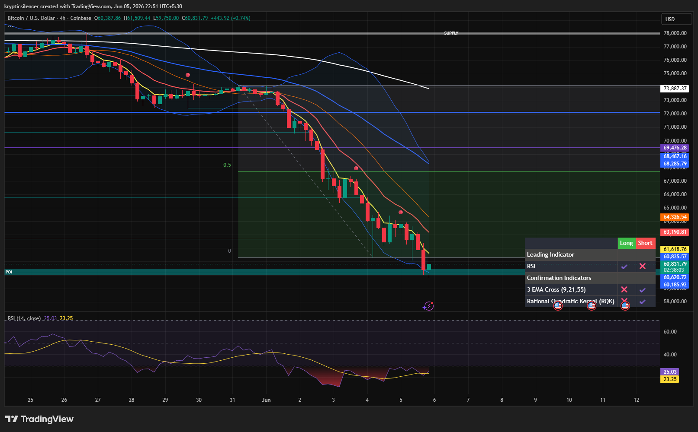

# Bitcoin — 4H Capitulation Into Major Demand Zone

**Date:** 2026-06-05
**Time:** ~22:51 IST
**Instrument:** BTCUSD
**Timeframe:** 4H
**Venue:** Coinbase
**Charting Platform:** TradingView

---

## Context

Bitcoin continues its aggressive bearish trend after failing to establish support during previous consolidation phases. Successive lower highs and lower lows have maintained strong downside pressure across the 4H timeframe.

The latest selloff has pushed price directly into a major higher-timeframe demand zone, an area where buyers previously entered the market with significant conviction.

---

## Observation

### 1️⃣ Bearish Trend Remains Intact

* Price continues printing lower highs and lower lows.
* No meaningful bullish structure shift has occurred.
* Every recovery attempt has been rejected by descending EMA resistance.

Market structure remains decisively bearish.

### 2️⃣ Strong Bearish Expansion

* Multiple impulsive bearish candles accelerated the decline.
* Price broke through several support levels with little resistance.
* Volatility expanded significantly during the move lower.

This reflects strong seller control and persistent liquidation pressure.

### 3️⃣ Demand Zone Test

* Price has reached a major demand region near 60k.
* Initial reaction is visible as buyers attempt to defend support.
* The zone represents a critical decision point for market participants.

The current area may attract short-term buying interest.

### 4️⃣ Momentum Conditions

* RSI has fallen into deep oversold territory near 25.
* Selling momentum remains dominant despite a minor bounce.
* No confirmed bullish divergence is visible yet.

Momentum suggests caution when attempting to call a bottom.

### 5️⃣ EMA Structure

* All major EMAs remain bearishly aligned.
* Price is trading significantly below dynamic resistance.
* Trend continuation conditions remain intact.

Any recovery rally must first overcome substantial overhead resistance.

---

## Hypothesis

Bitcoin is testing a major demand zone after an extended bearish expansion.

Two conditional paths remain active:

### Scenario A — Demand Zone Reaction

Oversold conditions and higher-timeframe demand could trigger a relief rally toward nearby resistance and EMA clusters. Such a move would currently be considered corrective unless structure shifts bullish.

### Scenario B — Demand Failure

If buyers fail to defend the current support region, acceptance below demand could trigger another wave of downside expansion and continuation of the broader bearish trend.

Until a higher low and structure reclaim occur, the prevailing trend remains bearish.

---

## Invalidation / Confirmation

* Strong reclaim of nearby resistance and EMA cluster → bearish momentum weakens.
* Failure of the demand zone and new lower lows → bearish continuation confirmed.
* Bullish divergence and higher low formation → recovery thesis gains validity.

---

## Notes

This setup reflects a capitulation-style move into a significant demand zone, accompanied by deeply oversold RSI readings and persistent bearish EMA alignment. While a relief bounce becomes increasingly probable as price reaches support, the broader trend remains bearish until market structure demonstrates meaningful recovery.

Text formatting and clarity were assisted by AI; the market analysis and structural interpretation are independently conducted by the author.
This material is intended for educational and research documentation purposes only and does not constitute financial advice.
