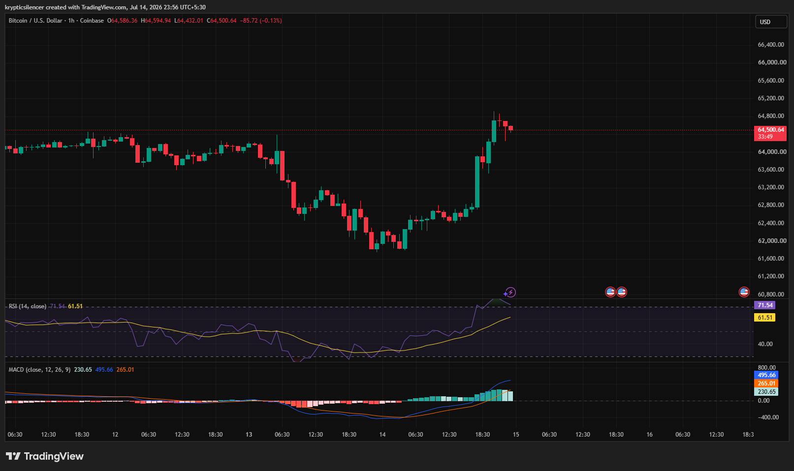

# Bitcoin — 1H Breakout Reclaims Momentum Above Recent Range

**Date:** 2026-07-14  
**Time:** ~23:56 IST  
**Instrument:** BTCUSD  
**Timeframe:** 1H  
**Venue:** Coinbase  
**Charting Platform:** TradingView  

---

## Context

Bitcoin has broken out of a multi-session consolidation after spending much of the past two days trading within a relatively narrow range. Buyers stepped in aggressively, driving price above recent resistance and reclaiming the 64,500 region.

The breakout shifts short-term momentum back in favor of the bulls.

---

## Observation

### 1️⃣ Strong Bullish Breakout

* Price exploded above the recent consolidation range.
* Large bullish candles confirm aggressive buying pressure.
* The breakout established a fresh short-term higher high.

Market structure has shifted decisively in favor of buyers.

### 2️⃣ Resistance Successfully Reclaimed

* Previous resistance has now been overcome.
* Price is attempting to hold above the breakout level.
* Continued acceptance above this area would strengthen the bullish trend.

The former ceiling may now act as support.

### 3️⃣ RSI Enters Overbought Territory

* RSI has surged above the 70 level.
* Momentum is exceptionally strong following the breakout.
* While overbought conditions increase pullback risk, they also reflect strong buying pressure.

Momentum heavily favors buyers.

### 4️⃣ MACD Shows Strong Bullish Expansion

* MACD remains well above the signal line.
* Histogram continues expanding positively.
* Momentum confirms the strength of the breakout.

Bullish momentum remains firmly intact.

### 5️⃣ Buyers Maintain Control

* The breakout erased the previous short-term weakness.
* Price is consolidating near the highs after the impulsive move.
* Holding above the breakout zone would support further upside.

The next reaction will determine whether momentum continues.

---

## Hypothesis

Bitcoin has regained bullish momentum after breaking above recent consolidation.

Two conditional paths remain active:

### Scenario A — Bullish Continuation

Holding above the breakout level could allow buyers to extend the rally toward the next resistance zone.

### Scenario B — Healthy Pullback

A short-term retracement toward the breakout area may occur before another attempt higher, provided support holds.

Current structure strongly favors buyers.

---

## Invalidation / Confirmation

* Hold above the breakout zone → bullish continuation strengthens.
* RSI remains above 50 with MACD maintaining a bullish crossover → momentum stays supportive.
* Loss of the breakout level → breakout weakens and consolidation may resume.

---

## Notes

Bitcoin has delivered a strong bullish breakout supported by expanding MACD momentum and an RSI reading above 70. Although overbought conditions increase the likelihood of short-term volatility, the overall structure currently favors buyers as long as the breakout level holds.

Text formatting and clarity were assisted by AI; the market analysis and structural interpretation are independently conducted by the author. This material is intended for educational and research documentation purposes only and does not constitute financial advice.
