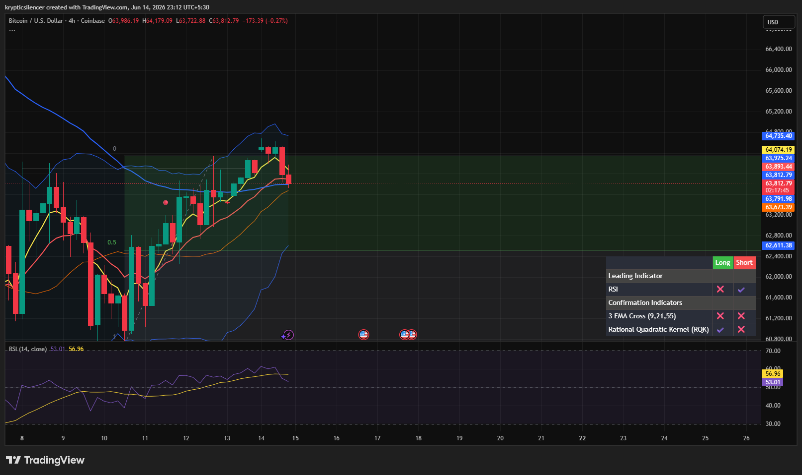

 # Bitcoin — 4H Pullback Within Recovery Structure

**Date:** 2026-06-14
**Time:** ~23:12 IST
**Instrument:** BTCUSD
**Timeframe:** 4H
**Venue:** Coinbase
**Charting Platform:** TradingView

---

## Context

Bitcoin has been recovering from the recent demand-zone reaction, establishing a sequence of higher lows and reclaiming short-term momentum over the past several sessions.

After pushing toward local highs, price has begun to pull back from resistance, creating the first meaningful retracement within the ongoing recovery structure.

---

## Observation

### 1️⃣ Recovery Trend Remains Intact

* Price successfully advanced from the recent swing low.
* Higher lows and higher highs have formed throughout the recovery.
* No major bearish structure break has occurred.

The broader short-term trend remains constructive despite the current pullback.

### 2️⃣ Rejection Near Local Highs

* Buyers pushed price toward the upper boundary of the recent range.
* Multiple candles showed hesitation near resistance.
* The latest bearish candle reflects profit-taking and reduced upside momentum.

This suggests buyers are encountering supply after the recent advance.

### 3️⃣ EMA Support Test

* Price has pulled back toward the fast EMA cluster.
* Dynamic support remains directly beneath current price.
* The retracement has not yet broken the bullish EMA structure.

The reaction around these moving averages will be important for trend continuation.

### 4️⃣ RSI Cooling From Strength

* RSI remains above the midline despite recent weakness.
* Momentum has cooled from local highs.
* No major bearish divergence is visible.

Momentum remains constructive while allowing the market to reset from elevated levels.

### 5️⃣ Healthy Retracement Characteristics

* The decline has been gradual rather than impulsive.
* Previous breakout levels remain intact.
* Price continues trading above key support within the recovery range.

Current price action resembles a corrective pullback rather than a trend reversal.

---

## Hypothesis

Bitcoin appears to be undergoing a normal retracement within a broader recovery phase.

Two conditional paths remain active:

### Scenario A — Bullish Continuation

If buyers defend EMA support and establish a higher low, the recovery trend could resume with another attempt toward recent highs and higher liquidity.

### Scenario B — Deeper Correction

Failure to hold current support could trigger a larger retracement toward the midpoint of the recovery range and test whether demand remains active.

As long as higher lows remain intact, buyers retain the structural advantage.

---

## Invalidation / Confirmation

* Higher low formation and reclaim of recent highs → bullish continuation confirmed.
* Loss of EMA support and breakdown below recent swing support → recovery thesis weakens.
* Sustained trading above the recovery range midpoint → bullish structure remains valid.

---

## Notes

This setup reflects a typical pullback following a strong recovery move. The market is currently testing whether recent buyers remain committed after the advance. While momentum has cooled, the broader recovery structure remains intact until key support levels are lost.

Text formatting and clarity were assisted by AI; the market analysis and structural interpretation are independently conducted by the author.
This material is intended for educational and research documentation purposes only and does not constitute financial advice.
